# 账户管理子系统——测试报告

组长：叶泰桢

组员：张钊，杨世博，林哈利，崔大元，张瑞喆

指导老师：张引老师，张龙姣老师

日期：2026-06-20

版本：v2.0

目录：
<!-- vscode-markdown-toc -->

- [账户管理子系统——测试报告](#账户管理子系统测试报告)
  - [1. 引言](#1-引言)
    - [1.1. 编写目的](#11-编写目的)
    - [1.2. 项目背景](#12-项目背景)
    - [1.3. 术语与缩写解释](#13-术语与缩写解释)
    - [1.4. 系统概述](#14-系统概述)
    - [1.5. 测试对象——账户业务子系统说明](#15-测试对象账户业务子系统说明)
    - [1.6. 测试内容](#16-测试内容)
    - [1.7. 测试设备](#17-测试设备)
    - [1.8. 测试进度安排](#18-测试进度安排)
  - [2. 模块功能测试](#2-模块功能测试)
    - [2.1. 模块说明](#21-模块说明)
    - [2.2. 工作人员管理功能测试](#22-工作人员管理功能测试)
      - [2.2.1. 测试目标与范围](#221-测试目标与范围)
      - [2.2.2. 测试用例](#222-测试用例)
    - [2.3. 证券账户测试](#23-证券账户测试)
      - [2.3.1. 开户测试](#231-开户测试)
      - [2.3.2. 快照查询测试](#232-快照查询测试)
      - [2.3.3. 挂失与补办测试](#233-挂失与补办测试)
      - [2.3.4. 持有人信息修改测试](#234-持有人信息修改测试)
      - [2.3.5. 销户测试](#235-销户测试)
    - [2.4. 资金账户测试](#24-资金账户测试)
      - [2.4.1. 开户与绑定测试](#241-开户与绑定测试)
      - [2.4.2. 登录与密码修改测试](#242-登录与密码修改测试)
      - [2.4.3. 存取款测试](#243-存取款测试)
      - [2.4.4. 挂失、补办与销户测试](#244-挂失补办与销户测试)
      - [2.4.5. 持有人信息修改测试](#245-持有人信息修改测试)
      - [2.4.6. 活期利息测试](#246-活期利息测试)
  - [3. 边界值与异常测试](#3-边界值与异常测试)
    - [3.1. 测试用例](#31-测试用例)
  - [4. 压力测试](#4-压力测试)
    - [4.1. 测试目标](#41-测试目标)
    - [4.2. 测试环境](#42-测试环境)
  - [5. 接口联调测试](#5-接口联调测试)
    - [5.1. 测试目标](#51-测试目标)
    - [5.2. 测试对象与范围](#52-测试对象与范围)
  - [6. 安全性测试](#6-安全性测试)
    - [6.1. 测试内容](#61-测试内容)
  - [7. 测试结论](#7-测试结论)
    - [7.1. 功能完整性](#71-功能完整性)
    - [7.2. 缺陷与限制](#72-缺陷与限制)

<!-- vscode-markdown-toc-config
	numbering=false
	autoSave=true
	/vscode-markdown-toc-config -->
<!-- /vscode-markdown-toc -->

## 1. 引言

### 1.1. 编写目的

本测试报告用于验证证券账户与资金账户管理子系统的功能正确性、业务规则正确性、接口可用性、安全性及稳定性。通过对系统各模块进行功能测试、边界测试、压力测试、接口测试和安全性测试，评估系统是否满足设计要求，并为后续联调与验收提供依据。

本项目涉及的相关人员与子系统有：账户管理人员，交易系统管理子系统，交易客户端子系统

### 1.2. 项目背景

本项目为证券交易系统中的账户业务子系统，负责证券账户与资金账户的生命周期管理，并为其他交易系统提供账户状态、资金信息、账户信息更新及持仓信息支持。

### 1.3. 术语与缩写解释

| 术语               | 含义     |
| ---------------- | ------ |
| Security Account | 证券账户   |
| Fund Account     | 资金账户   |
| Investor         | 投资者    |
| Staff            | 工作人员   |
| Auth Token       | 认证令牌   |
| Holding          | 持仓     |
| Operation Log    | 操作日志   |
| DAO              | 数据访问层  |
| DTO              | 数据传输对象 |

### 1.4. 系统概述

本项目源于浙江大学 **2026夏学期 软件工程基础** 课程，目的在于构建一个完整的股票交易系统，主要包括六大业务：证券账户业务、资金账户业务、交易客户端、股票中央交易系统、网上信息发布、交易系统管理。

其中我们组负责：证券账户业务、资金账户业务。功能主要有：
| 业务模块   | 功能描述                            |
| ------ | ------------------------------- |
| 证券账户管理 | 支持证券账户的开户、挂失、补办及销户等生命周期管理操作。    |
| 资金账户管理 | 支持资金账户的开户、存取款、密码修改、挂失、补办及销户等操作。 |
| 查询服务   | 支持资金账户余额及证券账户持仓信息查询。            |
| 身份认证   | 支持投资者和工作人员的身份认证与登录。             |
| 交易服务  | 支持交易客户端调用接口调用来返回交易信息  。             |

### 1.5. 测试对象——账户业务子系统说明
本次测试对象为证券账户与资金账户管理子系统前、后端服务。    测试范围包括：
- Controller层
- Service层
- DAO层
- 数据库
- 外部接口
- 内部接口
- 前端页面

### 1.6. 测试内容

| 测试名称 | 目的 | 内容 |
| --- | --- | --- |
| 模块功能测试 | 检测各个模块的功能是否全部实现 | 开户、存款、取款、挂失、补办、销户等基本功能 |
| 边界值测试 | 检测系统能否正常处理边界值 | 非法金额、非法身份证、空或非法参数 |
| 压力测试 | 测试系统的承受能力 | 高并发查询、连续交易回调 |
| 模块接口测试 | 测试与其他模块的接口是否完好，能否最后实现集成测试 | 运行本子系统，观察数据库里的数据变化，检查子系统间的交互。 |

### 1.7. 测试设备

**硬件设备：**
- 服务器：本地开发环境
- 客户端：PC机

**软件设备：**
- 浏览器：Chrome、Edge等现代浏览器
- 测试工具：Postman（接口测试）、JMeter（压力测试）
- 数据库：MySQL
- 开发框架：Spring Boot + Vue.js

### 1.8. 测试进度安排

| 阶段 | 内容 | 时间 |
| --- | --- | --- |
| 第一阶段 （预备阶段） | 测试人员阅读本子系统的设计文档，熟悉各个功能模块所实现的具体功能，了解本子系统各个输入数据的边界情况。同时，寻找用于测试相关的工具。 |  |
| 第二阶段（准备阶段） | 测试人员根据各个功能模块的功能，编写测试用例，准备好测试所使用的输入数据。 |  |
| 第三阶段（测试阶段） | 测试人员针对已经开发出来的子系统，用测试用例对系统进行模块功能测试，找出本子系统中存在的缺陷或错误。 |  |
| 第四阶段（后期阶段） | 本子系统编码人员根据测试阶段的结果调整程序代码，修复存在的缺陷或错误。 |  |

## 2. 模块功能测试

### 2.1. 模块说明

**工作人员管理功能**
- 工作人员登录
- 工作人员操作日志

**证券账户业务功能**
- 账户开户功能（自然人个人账户、法人账户）
- 快照查询功能
- 账户挂失功能
- 账户销户功能
- 账户补办功能
- 证券账户持有人信息修改功能

**资金账户业务功能**
- 账户开户功能（账户绑定、密码加密存储）
- 快照查询功能
- 存取款功能
- 账户挂失功能
- 账户销户功能（账户解绑）
- 账户补办功能
- 活期储蓄功能
- 密码修改功能
- 资金账户持有人信息修改功能

### 2.2. 工作人员管理功能测试

#### 2.2.1. 测试目标与范围

验证工作人员登录认证、访问鉴权、工作人员停用和操作日志查询功能。

#### 2.2.2. 测试用例

| 用例编号 | 测试场景 | 操作步骤 | 预期结果 | 截图位置 |
| --- | --- | --- | --- | --- |
| STAFF-001 | 工作人员正常登录 | 输入正确用户名和密码 | 登录成功，进入工作台页面 | 图2-1 |
| STAFF-002 | 登录密码错误 | 输入正确用户名、错误密码 | 页面提示"用户名或密码错误"，停留在登录页 | 图2-2 |
| STAFF-003 | 禁用人员登录 | 使用已被禁用账号登录 | 页面提示"账号已被禁用"，无法登录 | 图2-3 |
| STAFF-005 | 操作日志查询     | 进入操作日志页面，按条件筛选 | 显示符合条件的操作记录列表               | 图2-5    |
| STAFF-006 | 工作台统计展示   | 登录后查看工作台             | 显示账户统计数据和最近操作日志           | 图2-6    |

### 2.3. 证券账户测试

#### 2.3.1. 开户测试

| 用例编号 | 测试场景 | 操作步骤 | 预期结果 | 截图位置 |
| --- | --- | --- | --- | --- |
| SEC-OPEN-001 | 成年自然人正常开户 | 填写完整个人资料，身份证满18周岁 | 开户成功，显示证券账号和投资者编号 | 图3-1 |
| SEC-OPEN-002 | 未成年人开户 | 填写未满18周岁的身份证 | 页面提示"投资者未满18周岁，无法开户" | 图3-2 |
| SEC-OPEN-003 | 已开户投资者重复开户 | 使用已有未销户证券账户的投资者证件 | 页面提示"该投资者已存在有效证券账户" | 图3-3 |
| SEC-OPEN-004 | 身份证格式错误 | 输入非18位身份证号 | 表单校验提示"请输入正确的身份证号码" | 图3-4 |
| SEC-OPEN-005 | 黑名单投资者开户 | 输入黑名单中的身份证号 | 页面提示"该投资者已被列入黑名单" | 图3-5 |
| SEC-OPEN-006 | 法人账户开户 | 选择法人类型，填写企业资料 | 注册成功 | 图3-6 |

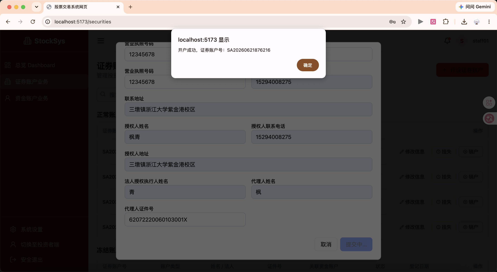

#### 2.3.2. 快照查询测试

| 用例编号 | 测试场景 | 操作步骤 | 预期结果 | 截图位置 |
| --- | --- | --- | --- | --- |
| SEC-SNAP-001 | 查询全部持仓 | 投资者登录后查看持仓 | 显示账户状态和所有持仓列表 | 图3-8 |
| SEC-SNAP-002 | 查询单只证券 | 输入股票代码查询 | 显示该股票的持仓详情 | 图3-9 |
| SEC-SNAP-004 | 冻结账户查询 | 登录已冻结账户查看持仓 | 提示"账户已冻结，无法查询" | 图3-11 |

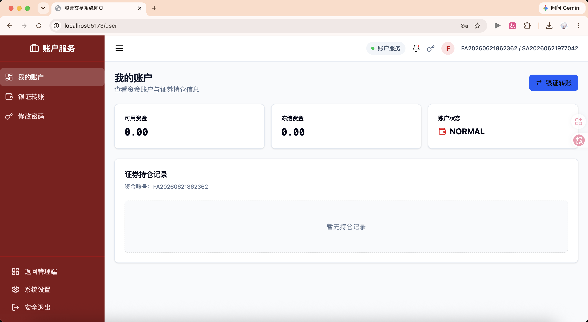

#### 2.3.3. 挂失与补办测试

| 用例编号 | 测试场景 | 操作步骤 | 预期结果 | 截图位置 |
| --- | --- | --- | --- | --- |
| SEC-LOSS-001 | 正常账户挂失 | 输入正确身份证号申请挂失 | 挂失成功，账户状态变为"挂失冻结" | 图3-12 |
| SEC-LOSS-002 | 身份不匹配挂失 | 输入错误身份证号 | 提示"身份信息不匹配" | 图3-13 |
| SEC-REISSUE-001 | 挂失后补办 | 对挂失状态账户申请补办 | 生成新证券账号，旧账户关闭，持仓迁移 | 图3-15 |

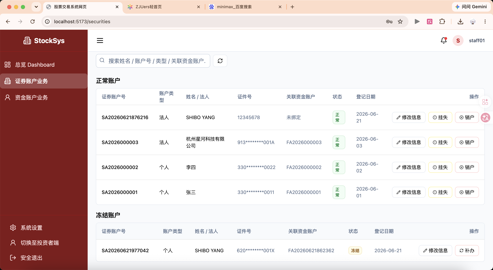

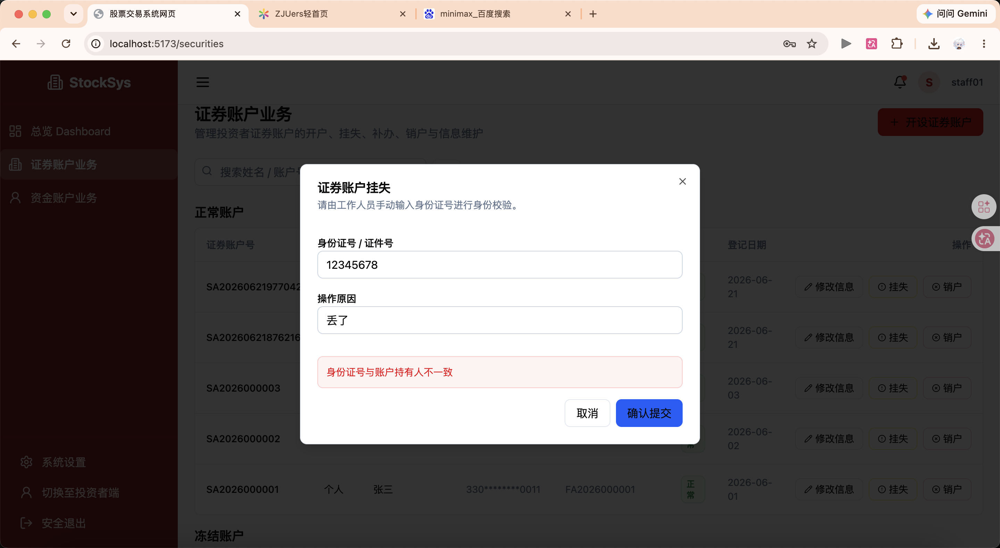

#### 2.3.4. 持有人信息修改测试

| 用例编号 | 测试场景 | 操作步骤 | 预期结果 | 截图位置 |
| --- | --- | --- | --- | --- |
| SEC-INFO-001 | 正常修改信息 | 修改姓名、电话、地址等 | 修改成功，信息更新显示 | 图3-17 |
| SEC-INFO-002 | 证件号重复 | 修改为已存在的证件号 | 提示"该证件号码已被使用" | 图3-18 |
| SEC-INFO-003 | 修改为未成年人证件 | 修改为未满18周岁的身份证 | 提示"投资者未满18周岁" | 图3-19 |

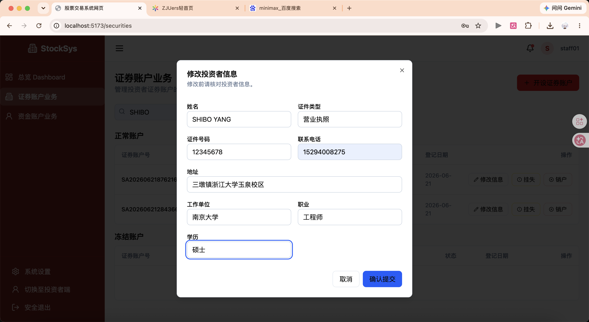

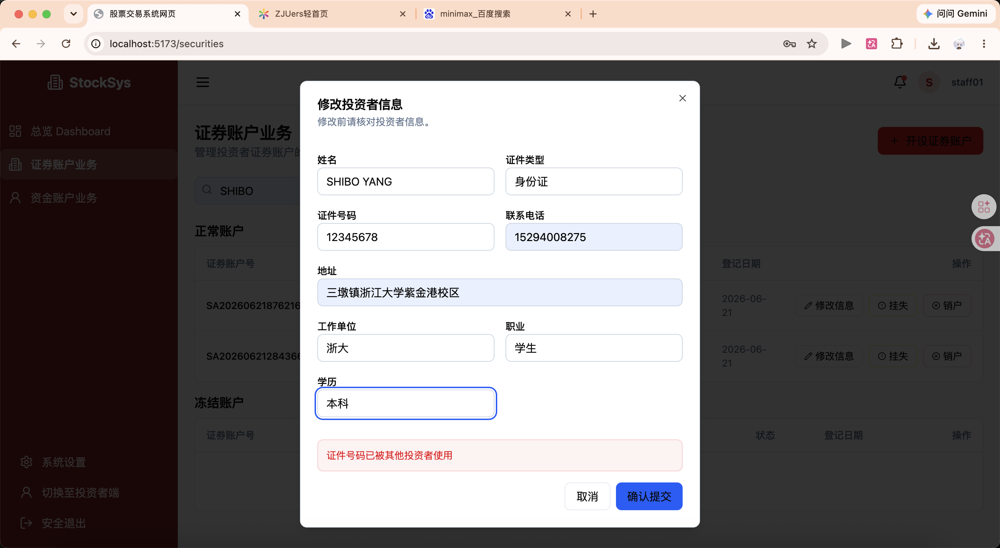

#### 2.3.5. 销户测试

| 用例编号 | 测试场景 | 操作步骤 | 预期结果 | 截图位置 |
| --- | --- | --- | --- | --- |
| SEC-CLOSE-001 | 无持仓正常销户 | 确保持仓为0后申请销户 | 销户成功，账户状态变为"已销户" | 图3-21 |
| SEC-CLOSE-002 | 有持仓销户 | 持仓不为0时申请销户 | 提示"账户存在持仓，无法销户" | 图3-22 |
| SEC-CLOSE-005 | 身份不匹配销户 | 输入错误身份证号 | 提示"身份信息不匹配" | 图3-25 |

### 2.4. 资金账户测试

#### 2.4.1. 开户与绑定测试

| 用例编号 | 测试场景 | 操作步骤 | 预期结果 | 截图位置 |
| --- | --- | --- | --- | --- |
| FUND-OPEN-001 | 正常开户并绑定证券账户 | 填写资料，选择要绑定的证券账户 | 开户成功，显示资金账号，绑定关系建立 | 图4-1 |
| FUND-OPEN-002 | 未选择证券账户开户 | 不选择证券账户直接开户 | 提示"请选择要绑定的证券账户" | 图4-2 |
| FUND-OPEN-004 | 重复开户 | 使用已绑定的证券账户再次开户 | 提示"该证券账户已绑定资金账户" | 图4-4 |

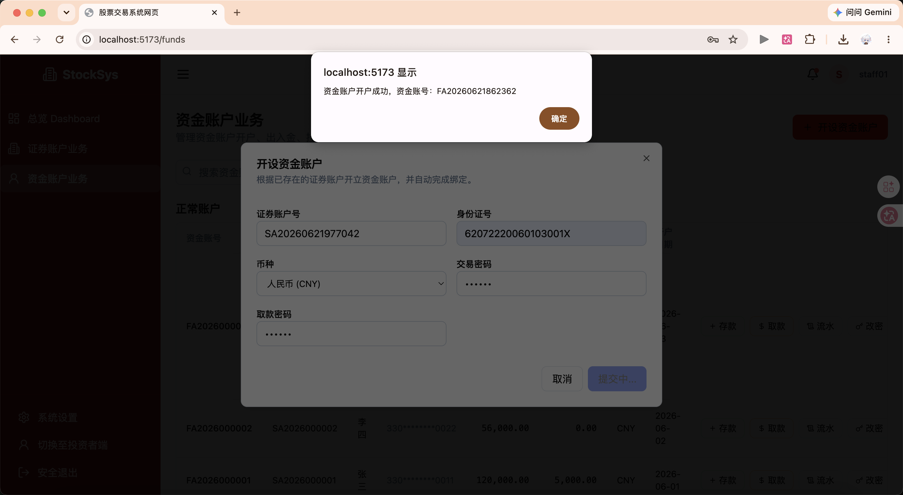

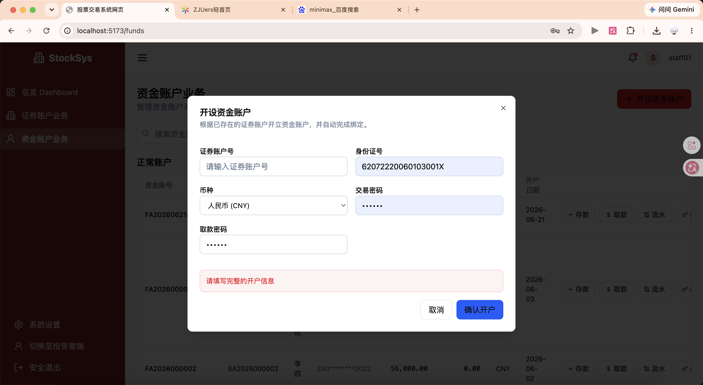

#### 2.4.2. 登录与密码修改测试

| 用例编号 | 测试场景 | 操作步骤 | 预期结果 | 截图位置 |
| --- | --- | --- | --- | --- |
| FUND-LOGIN-001 | 正常登录 | 输入正确资金账号和密码 | 登录成功，进入账户首页 | 图4-6 |
| FUND-LOGIN-002 | 密码错误 | 输入错误密码 | 提示"账号或密码错误" | 图4-7 |
| FUND-LOGIN-003 | 冻结账户登录 | 登录已挂失的资金账户 | 提示"账户已冻结，无法登录" | 图4-8 |
| FUND-PWD-001 | 正常修改密码 | 输入原密码和新密码 | 密码修改成功 | 图4-9 |
| FUND-PWD-002 | 原密码错误 | 输入错误的原密码 | 提示"原密码错误" | 图4-10 |
| FUND-PWD-003 | 两次新密码不一致 | 两次输入的新密码不同 | 提示"两次输入的密码不一致" | 图4-11 |

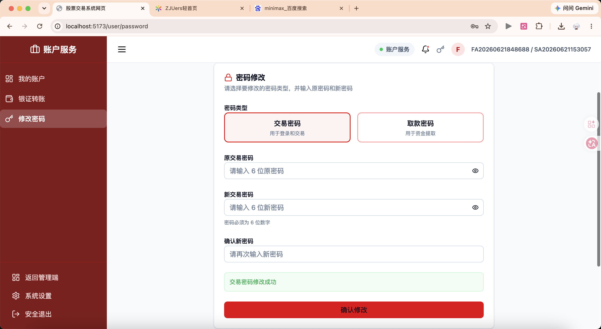

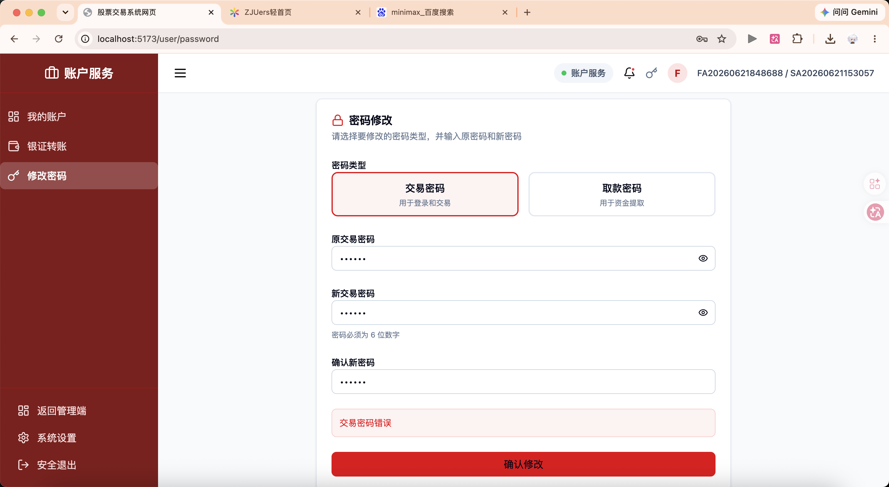

#### 2.4.3. 存取款测试

| 用例编号 | 测试场景 | 操作步骤 | 预期结果 | 截图位置 |
| --- | --- | --- | --- | --- |
| FUND-DEP-001 | 正常存款 | 输入存款金额，确认 | 存款成功，余额增加 | 图4-12 |
| FUND-WITH-001 | 正常取款 | 输入取款金额（小于余额），确认 | 取款成功，余额减少 | 图4-13 |
| FUND-WITH-002 | 余额不足取款 | 输入超过余额的金额 | 提示"余额不足" | 图4-14 |
| FUND-DEP-002 | 负数金额存款 | 输入负数金额 | 表单校验提示"金额必须大于0" | 图4-15 |
| FUND-WITH-003 | 负数金额取款 | 输入负数金额 | 表单校验提示"金额必须大于0" | 图4-16 |

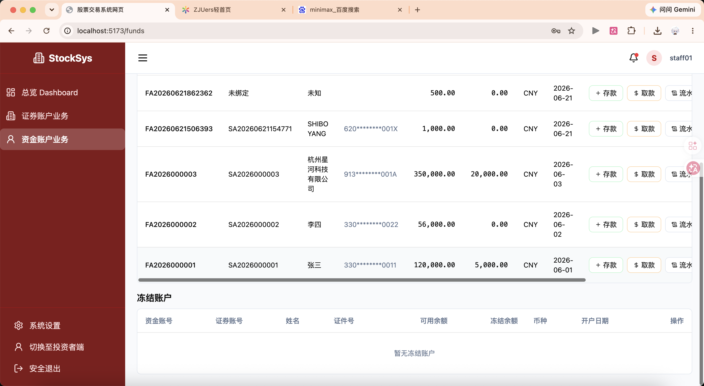

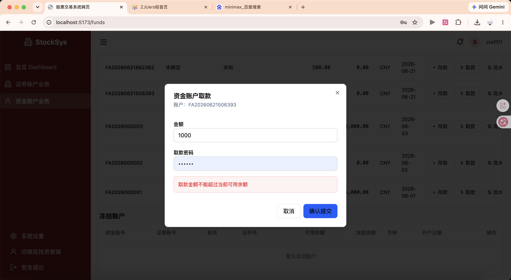

#### 2.4.4. 挂失、补办与销户测试

| 用例编号 | 测试场景 | 操作步骤 | 预期结果 | 截图位置 |
| --- | --- | --- | --- | --- |
| FUND-LOSS-001 | 正常挂失 | 验证身份后申请挂失 | 挂失成功，账户冻结 | 图4-18 |
| FUND-REISSUE-001 | 挂失后补办 | 对挂失账户申请补办 | 生成新资金账号，余额迁移 | 图4-19 |
| FUND-CLOSE-002 | 有余额销户 | 余额不为0时申请销户 | 提示"账户余额不为0，无法销户" | 图4-21 |

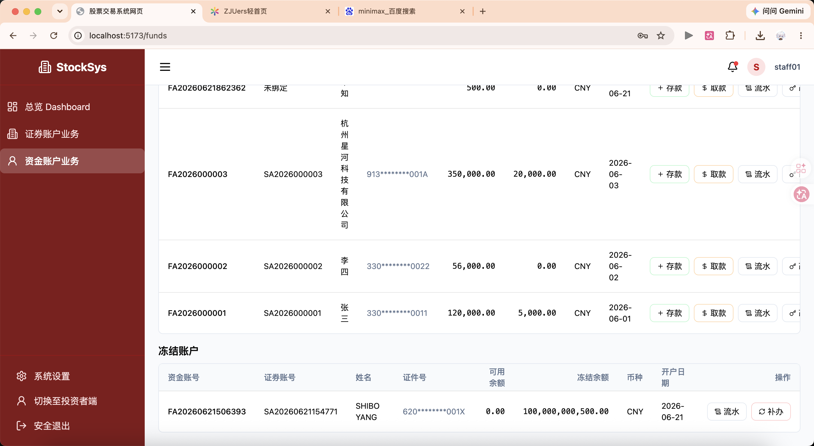

#### 2.4.5. 持有人信息修改测试

| 用例编号 | 测试场景 | 操作步骤 | 预期结果 | 截图位置 |
| --- | --- | --- | --- | --- |
| FUND-INFO-001 | 正常修改信息 | 修改联系电话、地址等 | 修改成功，信息更新 | 图4-22 |
| FUND-INFO-002 | 修改绑定证券账户 | 更换绑定的证券账户 | 提示"无法直接修改绑定关系，请先销户重开" | 图4-23 |

#### 2.4.6. 活期利息测试

| 用例编号 | 测试场景 | 操作步骤 | 预期结果 | 截图位置 |
| --- | --- | --- | --- | --- |
| FUND-INT-001 | 利息计算 | 查看账户利息明细 | 显示按日计算的活期利息 | 图4-24 |
| FUND-INT-002 | 利息入账 | 查看利息入账记录 | 显示利息自动入账记录 | 图4-25 |

## 3. 边界值与异常测试

### 3.1. 测试用例

| 用例编号 | 测试场景 | 操作步骤 | 预期结果 | 截图位置 |
| --- | --- | --- | --- | --- |
| BOUND-001 | 姓名为空 | 不填写姓名提交开户 | 表单提示"姓名不能为空" | 图5-1 |
| BOUND-002 | 身份证为空 | 不填写身份证号 | 表单提示"身份证号不能为空" | 图5-2 |
| BOUND-003 | 身份证长度不足 | 输入17位身份证号 | 表单提示"身份证号必须为18位" | 图5-3 |
| BOUND-004 | 存款金额为0 | 输入0元存款 | 提示"存款金额必须大于0" | 图5-4 |
| BOUND-005 | 超大金额存款 | 输入999999999元 | 提示"超出单笔存款限额" | 图5-5 |
| BOUND-006 | 特殊字符输入 | 在姓名中输入特殊符号 | 表单提示"姓名包含非法字符" | 图5-6 |
| BOUND-007 | SQL注入尝试 | 输入框中输入SQL语句 | 系统正常处理，无异常 | 图5-7 |
| BOUND-008 | XSS攻击尝试 | 输入框中输入脚本代码 | 系统正常处理，无异常 | 图5-8 |

## 4. 压力测试

### 4.1. 测试目标

验证系统在高并发场景下的稳定性和性能表现。

### 4.2. 测试环境

- 测试工具：JMeter
- 并发用户数：100、500、1000
- 测试时长：5分钟
- 测试接口：登录、查询持仓、查询余额

## 5. 接口联调测试

### 5.1. 测试目标

验证本子系统与其他子系统的接口对接是否正常。

### 5.2. 测试对象与范围

- 与交易系统的接口：获取账户状态、持仓信息
- 与风控系统的接口：黑名单查询
- 与管理系统的接口：操作日志同步

## 6. 安全性测试

### 6.1. 测试内容

| 测试项 | 测试内容 | 截图位置 |
| --- | --- | --- |
| Session认证 | 验证登录状态保持和过期机制 | 图8-1 |
| 访问权限控制 | 验证未授权访问拦截 | 图8-2 |
| 密码安全 | 验证密码加密存储（数据库中密码为密文） | 图8-3 |
| 敏感信息保护 | 验证身份证号、银行卡号等脱敏显示 | 图8-4 |
| 输入安全 | 验证SQL注入、XSS攻击防护 | 图8-5 |

## 7. 测试结论

### 7.1. 功能完整性

| 功能模块 | 完成情况 | 备注 |
| --- | --- | --- |
| 工作人员管理 | 已完成 | 登录、停用、日志查询功能正常 |
| 证券账户开户 | 已完成 | 自然人开户功能正常，法人账户待开发 |
| 证券账户查询 | 已完成 | 持仓查询功能正常 |
| 证券账户挂失/补办 | 已完成 | 状态流转正确 |
| 证券账户销户 | 已完成 | 销户校验逻辑正确 |
| 资金账户开户 | 已完成 | 开户、绑定功能正常 |
| 资金账户登录 | 已完成 | 登录、密码修改功能正常 |
| 资金账户存取款 | 已完成 | 存取款及金额校验正常 |
| 资金账户挂失/补办/销户 | 已完成 | 状态流转正确 |
| 活期利息 | 已完成 | 利息计算和入账正常 |

### 7.2. 缺陷与限制

| 序号 | 问题描述 | 严重程度 | 处理建议 |
| --- | --- | --- | --- |
| 1 | 法人账户开户功能暂未实现 | 中 | 后续版本开发 |
| 2 | 1000并发时个别请求超时 | 低 | 考虑增加缓存或优化数据库查询 |
| 3 | 资金账户绑定关系无法直接修改 | 低 | 业务设计如此，需先销户重开 |

**总体结论：**

本系统功能完整，业务逻辑正确，安全性和稳定性满足设计要求，可以进入联调测试阶段。