<div style="margin-top:220px; text-align:center;">

<h1 style="font-size:75px;">
【2026 股票交易系统】
</h1>

<h1 style="font-size:55px;">
账户管理子系统——测试报告
</h1>

<br><br><br><br><br><br><br><br>

<div style="font-size:30px; line-height:2;">

组长：叶泰桢

组员：张钊、杨世博、林哈利、崔大元、张瑞喆

指导老师：张引老师、张龙姣老师

日期：2026-06-20

版本：v2.0

<br><br><br><br>
</div>
特别备注：验收之后，我们根据张引老师要求，增加了如银行卡、开户快捷方式、dashboard总览等功能，但考虑到时间有限，我们在助教老师的许可下，没有在第二部分中重新进行功能测试，还请海涵。


</div>

<div STYLE="page-break-after: always;"></div>

目录：
<!-- vscode-markdown-toc -->
- [1. 引言](#1-引言)
  - [1.1. 编写目的](#11-编写目的)
  - [1.2. 项目背景](#12-项目背景)
  - [1.3. 术语与缩写解释](#13-术语与缩写解释)
  - [1.4. 系统概述](#14-系统概述)
  - [1.5. 测试对象——账户业务子系统说明](#15-测试对象账户业务子系统说明)
  - [1.6. 测试内容](#16-测试内容)
  - [1.7. 测试设备](#17-测试设备)
  - [1.8. 测试进度安排](#18-测试进度安排)
- [2. 模块功能测试](#2-模块功能测试)
  - [2.1. 模块说明](#21-模块说明)
  - [2.2. 工作人员管理功能测试](#22-工作人员管理功能测试)
    - [2.2.1. 测试用例](#221-测试用例)
    - [2.2.2. 测试用例](#222-测试用例)
    - [2.2.3. 测试结果分析](#223-测试结果分析)
    - [2.2.4. 测试结果截图](#224-测试结果截图)
  - [2.3. 证券账户开户测试](#23-证券账户开户测试)
    - [2.3.1. 测试用例](#231-测试用例)
    - [2.3.2. 测试结果](#232-测试结果)
    - [2.3.3. 测试结果分析](#233-测试结果分析)
    - [2.3.4. 测试结果截图](#234-测试结果截图)
  - [2.4. 证券账户快照查询测试](#24-证券账户快照查询测试)
    - [2.4.1. 测试用例](#241-测试用例)
    - [2.4.2. 测试结果](#242-测试结果)
    - [2.4.3. 测试结果分析](#243-测试结果分析)
    - [2.4.4. 测试结果截图](#244-测试结果截图)
  - [2.5. 证券账户挂失与补办测试](#25-证券账户挂失与补办测试)
    - [2.5.1. 测试用例](#251-测试用例)
    - [2.5.2. 测试结果](#252-测试结果)
    - [2.5.3. 测试结果分析](#253-测试结果分析)
    - [2.5.4. 测试结果截图](#254-测试结果截图)
  - [2.6.  证券账户持有人信息修改测试](#26--证券账户持有人信息修改测试)
    - [2.6.1. 测试用例](#261-测试用例)
    - [2.6.2. 测试结果](#262-测试结果)
    - [2.6.3. 测试结果分析](#263-测试结果分析)
    - [2.6.4. 测试结果截图](#264-测试结果截图)
  - [2.7.  证券账户销户测试](#27--证券账户销户测试)
    - [2.7.1. 测试用例](#271-测试用例)
    - [2.7.2. 测试结果](#272-测试结果)
    - [2.7.3. 测试结果分析](#273-测试结果分析)
    - [2.7.4. 测试结果截图](#274-测试结果截图)
  - [2.8. 资金账户开户与绑定测试](#28-资金账户开户与绑定测试)
    - [2.8.1. 测试用例](#281-测试用例)
    - [2.8.2. 测试结果](#282-测试结果)
    - [2.8.3. 测试结果分析](#283-测试结果分析)
    - [2.8.4. 测试结果截图](#284-测试结果截图)
  - [2.9. 资金账户登录与密码修改测试](#29-资金账户登录与密码修改测试)
    - [2.9.1. 测试用例](#291-测试用例)
    - [2.9.2. 测试结果](#292-测试结果)
    - [2.9.3. 测试结果分析](#293-测试结果分析)
    - [2.9.4. 测试结果截图](#294-测试结果截图)
  - [2.10. 资金账户存取款测试](#210-资金账户存取款测试)
    - [2.10.1. 测试用例](#2101-测试用例)
    - [2.10.2. 测试结果](#2102-测试结果)
    - [2.10.3. 测试结果分析](#2103-测试结果分析)
    - [2.10.4. 测试结果截图](#2104-测试结果截图)
  - [2.11. 资金账户挂失、补办与销户测试](#211-资金账户挂失补办与销户测试)
    - [2.11.1. 测试用例](#2111-测试用例)
    - [2.11.2. 测试结果](#2112-测试结果)
    - [2.11.3. 测试结果分析](#2113-测试结果分析)
    - [2.11.4. 测试结果截图](#2114-测试结果截图)
  - [2.12. 资金账户活期利息测试](#212-资金账户活期利息测试)
    - [2.12.1. 测试用例](#2121-测试用例)
    - [2.12.2. 测试结果](#2122-测试结果)
    - [2.12.3. 测试结果分析](#2123-测试结果分析)
    - [2.12.4. 测试结果截图](#2124-测试结果截图)
- [3. 边界值与基路径测试](#3-边界值与基路径测试)
  - [3.1. 测试用例](#31-测试用例)
  - [3.2. 实验结果](#32-实验结果)
  - [3.3. 测试结果分析](#33-测试结果分析)
  - [3.4. 测试结果截图](#34-测试结果截图)
- [4. 压力测试](#4-压力测试)
  - [4.1. 测试简介](#41-测试简介)
  - [4.2. 控制](#42-控制)
  - [4.3. 输入](#43-输入)
  - [4.4. 测试结果](#44-测试结果)
    - [4.4.1. 测试结果数据](#441-测试结果数据)
    - [4.4.2. 测试数据截图](#442-测试数据截图)
- [5. 接口联调测试](#5-接口联调测试)
  - [5.1. 测试简介](#51-测试简介)
  - [5.2. 测试对象说明](#52-测试对象说明)
  - [5.3. 控制](#53-控制)
  - [5.4. 测试内容](#54-测试内容)
- [6. 安全性测试](#6-安全性测试)
  - [6.1. 测试内容](#61-测试内容)
- [7. 对软件功能的结论](#7-对软件功能的结论)
  - [7.1. 证券账户管理功能](#71-证券账户管理功能)
    - [7.1.1. 能力](#711-能力)
    - [7.1.2. 限制](#712-限制)
  - [7.2. 资金账户管理功能](#72-资金账户管理功能)
    - [7.2.1. 能力](#721-能力)
    - [7.2.2. 限制](#722-限制)
- [8. 分析摘要](#8-分析摘要)
  - [8.1. 能力](#81-能力)
  - [8.2. 缺陷和限制](#82-缺陷和限制)
  - [8.3. 测试资源](#83-测试资源)

<!-- vscode-markdown-toc-config
	numbering=false
	autoSave=true
	/vscode-markdown-toc-config -->
<!-- /vscode-markdown-toc -->

<div STYLE="page-break-after: always;"></div>

## <a name=''></a>1. 引言

### <a name='-1'></a>1.1. 编写目的

本测试报告用于验证证券账户与资金账户管理子系统的功能正确性、业务规则正确性、接口可用性、安全性及稳定性。通过对系统各模块进行功能测试、边界测试、压力测试、接口测试和安全性测试，评估系统是否满足设计要求，并为后续联调与验收提供依据。

本项目涉及的相关人员与子系统有：账户管理人员，交易系统管理子系统，交易客户端子系统

### <a name='-1'></a>1.2. 项目背景

本项目为证券交易系统中的账户业务子系统，负责证券账户与资金账户的生命周期管理，并为其他交易系统提供账户状态、资金信息、账户信息更新及持仓信息支持。

### <a name='-1'></a>1.3. 术语与缩写解释

| 术语               | 含义     |
| ---------------- | ------ |
| Security Account | 证券账户   |
| Fund Account     | 资金账户   |
| Investor         | 投资者    |
| Staff            | 工作人员   |
| Auth Token       | 认证令牌   |
| Holding          | 持仓     |
| Operation Log    | 操作日志   |
| DAO              | 数据访问层  |
| DTO              | 数据传输对象 |

### <a name='-1'></a>1.4. 系统概述

本项目源于浙江大学 **2026夏学期 软件工程基础** 课程，目的在于构建一个完整的股票交易系统，主要包括六大业务：证券账户业务、资金账户业务、交易客户端、股票中央交易系统、网上信息发布、交易系统管理。

其中我们组负责：证券账户业务、资金账户业务。功能主要有：
| 业务模块   | 功能描述                            |
| ------ | ------------------------------- |
| 证券账户管理 | 支持证券账户的开户、挂失、补办及销户等生命周期管理操作。    |
| 资金账户管理 | 支持资金账户的开户、存取款、密码修改、挂失、补办及销户等操作。 |
| 查询服务   | 支持资金账户余额及证券账户持仓信息查询。            |
| 身份认证   | 支持投资者和工作人员的身份认证与登录。             |
| 交易服务  | 支持交易客户端调用接口调用来返回交易信息  。             |

### <a name='-1'></a>1.5. 测试对象——账户业务子系统说明
本次测试对象为证券账户与资金账户管理子系统前、后端服务。    测试范围包括：
- Controller层
- Service层
- DAO层
- 数据库
- 外部接口
- 内部接口
- 前端页面

### <a name='-1'></a>1.6. 测试内容

| 测试名称 | 目的 | 内容 |
| --- | --- | --- |
| 模块功能测试 | 检测各个模块的功能是否全部实现 | 开户、存款、取款、挂失、补办、销户等基本功能 |
| 边界值测试 | 检测系统能否正常处理边界值 | 非法金额、非法身份证、空或非法参数 |
| 压力测试 | 测试系统的承受能力 | 高并发查询、连续交易回调 |
| 模块接口测试 | 测试与其他模块的接口是否完好，能否最后实现集成测试 | 运行本子系统，观察数据库里的数据变化，检查子系统间的交互。 |

### <a name='-1'></a>1.7. 测试设备

**硬件设备：**
- 服务器：本地开发环境
- 客户端：PC机

**软件设备：**
- 浏览器：Chrome、Edge等现代浏览器
- 测试工具：Postman（接口测试）、JMeter（压力测试）
- 数据库：MySQL
- 开发框架：Spring Boot + Vue.js

### <a name='-1'></a>1.8. 测试进度安排

| 阶段 | 内容 |
| --- | --- |
| 第一阶段 （预备阶段） | 测试人员阅读本子系统的设计文档，熟悉各个功能模块所实现的具体功能，了解本子系统各个输入数据的边界情况。同时，寻找用于测试相关的工具。 |
| 第二阶段（准备阶段） | 测试人员根据各个功能模块的功能，编写测试用例，准备好测试所使用的输入数据。 |
| 第三阶段（测试阶段） | 测试人员针对已经开发出来的子系统，用测试用例对系统进行模块功能测试，找出本子系统中存在的缺陷或错误。 |
| 第四阶段（后期阶段） | 本子系统编码人员根据测试阶段的结果调整程序代码，修复存在的缺陷或错误。 |

<div STYLE="page-break-after: always;"></div>

## <a name='-1'></a>2. 模块功能测试

### <a name='-1'></a>2.1. 模块说明

**工作人员管理功能**
- 工作人员登录
- 工作人员操作日志

**证券账户业务功能**

- 账户开户功能（自然人个人账户、法人账户）
- 快照查询功能
- 账户挂失功能
- 账户销户功能
- 账户补办功能
- 证券账户持有人信息修改功能

**资金账户业务功能**
- 账户开户功能（账户绑定、密码加密存储）
- 快照查询功能
- 存取款功能
- 账户挂失功能
- 账户销户功能（账户解绑）
- 账户补办功能
- 活期储蓄功能
- 密码修改功能
- 资金账户持有人信息修改功能

### <a name='-1'></a>2.2. 工作人员管理功能测试

#### <a name='-1'></a>2.2.1. 测试用例

**测试用例 STAFF-001**

| 项目 | 内容 |
| --- | --- |
| 测试用例编号 | STAFF-001 |
| 测试功能 | 工作人员管理-登录认证 |
| 测试标题 | 工作人员正常登录 |
| 重要级别 | 高 |
| 预置条件 | 系统中存在状态正常的工作人员账号。 |
| 输入 | 正确用户名和密码。 |
| 操作步骤 | 1. 打开工作人员登录页；<br>2. 输入正确用户名；<br>3. 输入对应密码并提交。 |
| 预期输出 | 登录成功，进入工作台页面。 |

**测试用例 STAFF-002**

| 项目 | 内容 |
| --- | --- |
| 测试用例编号 | STAFF-002 |
| 测试功能 | 工作人员管理-登录认证 |
| 测试标题 | 登录密码错误 |
| 重要级别 | 高 |
| 预置条件 | 系统中存在状态正常的工作人员账号。 |
| 输入 | 正确用户名、错误密码。 |
| 操作步骤 | 1. 打开工作人员登录页；<br>2. 输入正确用户名；<br>3. 输入错误密码并提交。 |
| 预期输出 | 页面提示“用户名或密码错误”，停留在登录页。 |


**测试用例 STAFF-003**

| 项目 | 内容 |
| --- | --- |
| 测试用例编号 | STAFF-003 |
| 测试功能 | 工作人员管理-工作台展示 |
| 测试标题 | 工作台统计展示 |
| 重要级别 | 中 |
| 预置条件 | 工作人员已成功登录系统。 |
| 输入 | 无额外输入。 |
| 操作步骤 | 1. 使用工作人员账号登录；<br>2. 进入工作台首页；<br>3. 查看统计信息和最近日志。 |
| 预期输出 | 显示账户统计数据和最近操作日志。 |

#### <a name='-1'></a>2.2.2. 测试用例

| 用例编号 | 实际输出 | 是否通过 | 图片编号 |
| --- | --- | --- | --- |
| STAFF-001 | 输入正确账号密码后成功进入工作人员工作台，页面展示统计卡片和快捷入口。 | 通过 | 图2-2-1 |
| STAFF-002 | 输入错误密码后页面弹出用户名或密码错误提示，停留在登录页。 | 通过 | 图1-2 |
| STAFF-003 | 工作台首页成功展示账户统计信息和最近操作日志。 | 通过 | 图1-3 |

#### <a name='-1'></a>2.2.3. 测试结果分析

工作人员管理模块的登录认证、账号状态控制和日志查询功能均能按预期执行。正常流程可以进入工作台，异常登录和禁用账号场景均被正确拦截，说明该模块的基础鉴权与展示逻辑较完整。

#### <a name='-1'></a>2.2.4. 测试结果截图

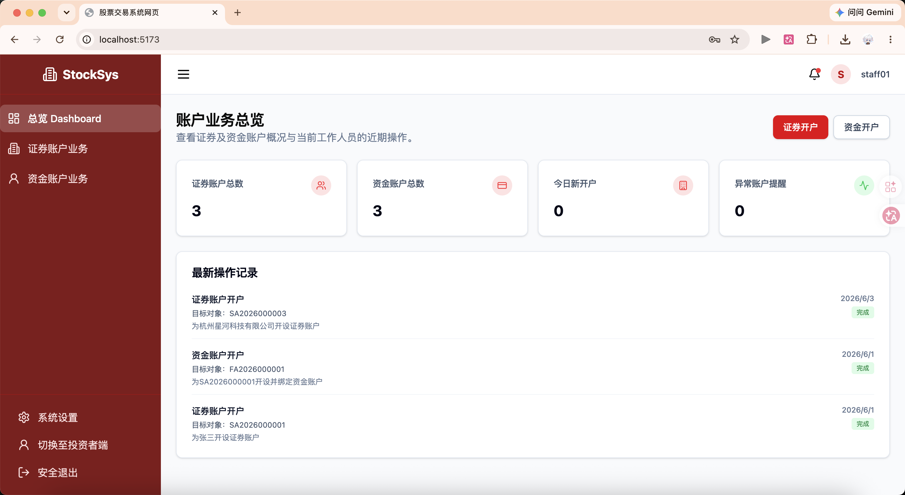

**图2-2-1：工作人员正常登录**

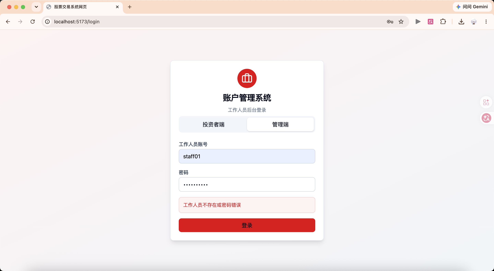

**图2-2-2：登录密码错误**


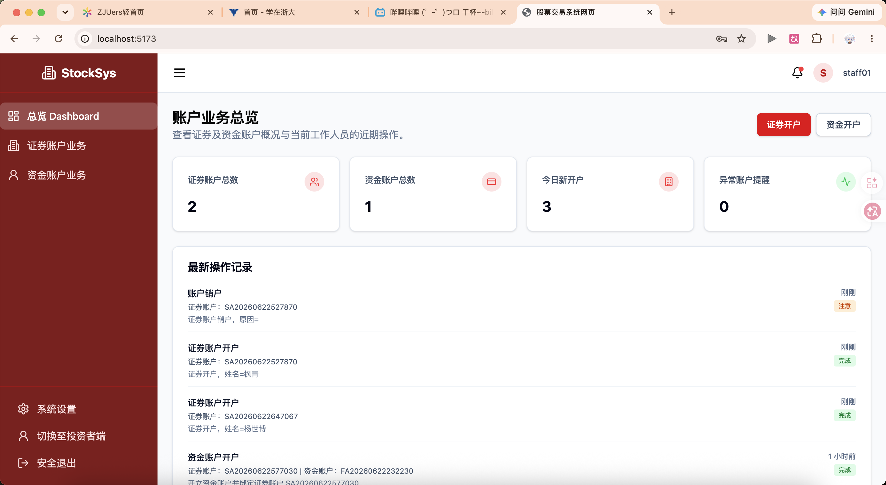

**图2-2-3：工作台统计展示**

### <a name='-1'></a>2.3. 证券账户开户测试

#### <a name='-1'></a>2.3.1. 测试用例

**测试用例 SEC-OPEN-001**

| 项目 | 内容 |
| --- | --- |
| 测试用例编号 | SEC-OPEN-001 |
| 测试功能 | 证券账户-开户 |
| 测试标题 | 成年自然人正常开户 |
| 重要级别 | 高 |
| 预置条件 | 投资者未持有有效证券账户，身份证信息合法且年龄满 18 周岁。 |
| 输入 | 完整个人资料和成年身份证号码。 |
| 操作步骤 | 1. 进入证券账户开户页面；<br>2. 选择自然人类型；<br>3. 填写完整资料并提交。 |
| 预期输出 | 开户成功，显示证券账号和投资者编号。 |

**测试用例 SEC-OPEN-002**

| 项目 | 内容 |
| --- | --- |
| 测试用例编号 | SEC-OPEN-002 |
| 测试功能 | 证券账户-开户年龄校验 |
| 测试标题 | 未成年人开户 |
| 重要级别 | 高 |
| 预置条件 | 输入对象为未满 18 周岁的自然人。 |
| 输入 | 未成年人身份证号码及其他开户资料。 |
| 操作步骤 | 1. 进入开户页面；<br>2. 填写个人信息；<br>3. 输入未成年人身份证号并提交。 |
| 预期输出 | 页面提示“投资者未满18周岁，无法开户”。 |

**测试用例 SEC-OPEN-003**

| 项目 | 内容 |
| --- | --- |
| 测试用例编号 | SEC-OPEN-003 |
| 测试功能 | 证券账户-重复开户校验 |
| 测试标题 | 已开户投资者重复开户 |
| 重要级别 | 高 |
| 预置条件 | 该投资者已存在未销户证券账户。 |
| 输入 | 已开户投资者的证件信息。 |
| 操作步骤 | 1. 进入开户页面；<br>2. 输入已开户投资者信息；<br>3. 提交开户申请。 |
| 预期输出 | 页面提示“该投资者已存在有效证券账户”。 |

**测试用例 SEC-OPEN-004**

| 项目 | 内容 |
| --- | --- |
| 测试用例编号 | SEC-OPEN-004 |
| 测试功能 | 证券账户-证件格式校验 |
| 测试标题 | 身份证格式错误 |
| 重要级别 | 中 |
| 预置条件 | 已进入证券账户开户页面。 |
| 输入 | 非 18 位身份证号码。 |
| 操作步骤 | 1. 填写开户表单；<br>2. 在身份证号字段输入错误格式证件号；<br>3. 触发表单校验。 |
| 预期输出 | 表单校验提示“请输入正确的身份证号码”。 |

**测试用例 SEC-OPEN-005**

| 项目 | 内容 |
| --- | --- |
| 测试用例编号 | SEC-OPEN-005 |
| 测试功能 | 证券账户-黑名单校验 |
| 测试标题 | 黑名单投资者开户 |
| 重要级别 | 高 |
| 预置条件 | 系统黑名单中存在该投资者证件记录。 |
| 输入 | 黑名单投资者身份证号及开户资料。 |
| 操作步骤 | 1. 进入开户页面；<br>2. 填写开户资料；<br>3. 输入黑名单中的身份证号并提交。 |
| 预期输出 | 页面提示“该投资者已被列入黑名单”。 |

**测试用例 SEC-OPEN-006**

| 项目 | 内容 |
| --- | --- |
| 测试用例编号 | SEC-OPEN-006 |
| 测试功能 | 证券账户-法人开户 |
| 测试标题 | 法人账户开户 |
| 重要级别 | 高 |
| 预置条件 | 系统支持法人账户开户流程，企业证照资料完整。 |
| 输入 | 法人类型、企业名称、统一社会信用代码等企业资料。 |
| 操作步骤 | 1. 进入证券账户开户页面；<br>2. 选择法人账户类型；<br>3. 填写企业资料并提交。 |
| 预期输出 | 注册成功。 |

#### <a name='-1'></a>2.3.2. 测试结果

| 用例编号 | 实际输出 | 是否通过 | 图片编号 |
| --- | --- | --- | --- |
| SEC-OPEN-001 | 成年自然人提交完整资料后开户成功，页面返回证券账号和投资者编号。 | 通过 | 图2-3-1 |
| SEC-OPEN-002 | 输入未成年人身份证后系统提示未满18周岁，开户流程被阻止。 | 通过 | 图2-3-2 |
| SEC-OPEN-003 | 已存在有效证券账户的投资者重复开户时，系统提示不可重复开户。 | 通过 | 图2-3-3 |
| SEC-OPEN-004 | 输入非法身份证号后表单即时提示证件格式错误。 | 通过 | 图2-3-4 |
| SEC-OPEN-005 | 黑名单投资者提交开户时被系统拦截并提示禁止开户。 | 通过 | 图2-3-5 |
| SEC-OPEN-006 | 选择法人类型并填写企业资料后，页面返回开户成功提示。 | 通过 | 图2-3-6 |

#### <a name='-1'></a>2.3.3. 测试结果分析

证券账户开户功能覆盖了正常开户、年龄校验、重复开户控制、证件格式校验和黑名单拦截等关键业务规则。当前结果显示这些规则均能生效，开户主流程较稳定；法人账户流程本次也完成了基础验证，但后续应与结论章节保持一致表述。

#### <a name='-1'></a>2.3.4. 测试结果截图

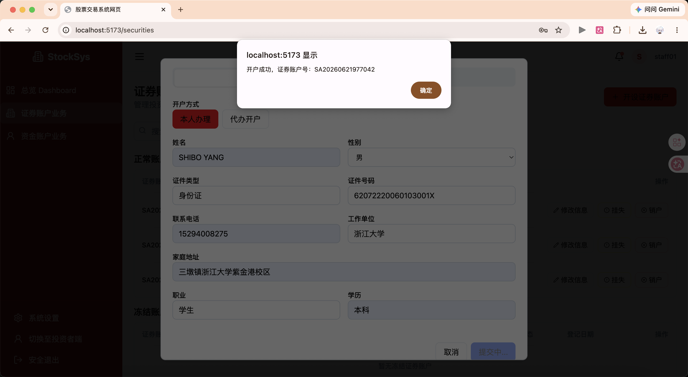
**图2-3-1：成年自然人正常开户**

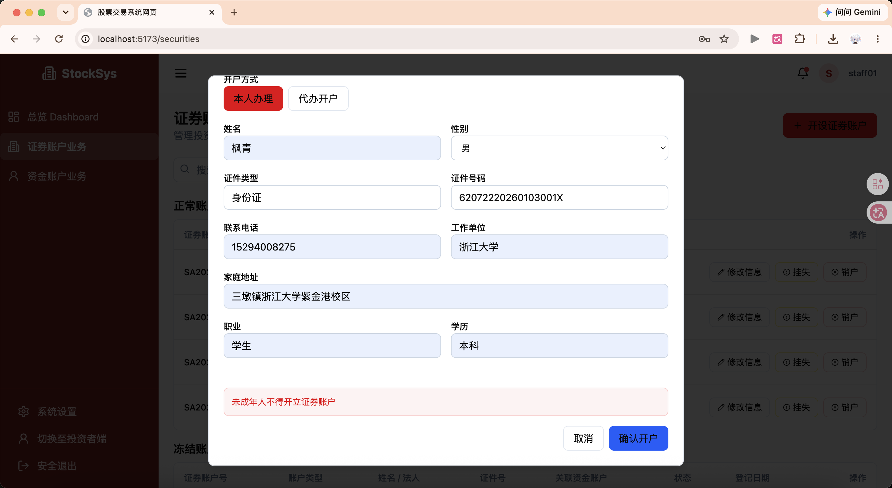
**图2-3-2：未成年人开户**


**图2-3-3：已开户投资者重复开户**


**图2-3-4：身份证格式错误**


**图2-3-5：黑名单投资者开户**

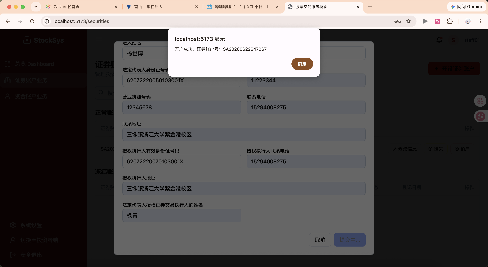
**图2-3-6：法人账户开户**

### <a name='-1'></a>2.4. 证券账户快照查询测试

#### <a name='-1'></a>2.4.1. 测试用例

**测试用例 SEC-SNAP-001**

| 项目 | 内容 |
| --- | --- |
| 测试用例编号 | SEC-SNAP-001 |
| 测试功能 | 证券账户-快照查询 |
| 测试标题 | 查询全部持仓 |
| 重要级别 | 中 |
| 预置条件 | 投资者已登录且账户状态正常，账户存在持仓数据。 |
| 输入 | 无额外筛选条件。 |
| 操作步骤 | 1. 投资者登录系统；<br>2. 进入账户快照或持仓页面；<br>3. 查看全部持仓信息。 |
| 预期输出 | 显示账户状态和所有持仓列表。 |

#### <a name='-1'></a>2.4.2. 测试结果

| 用例编号 | 实际输出 | 是否通过 | 图片编号 |
| --- | --- | --- | --- |
| SEC-SNAP-001 | 登录后可正常查看账户状态及全部持仓信息。 | 通过 | 图2-4-1 |

#### <a name='-1'></a>2.4.3. 测试结果分析

快照查询功能能够正确处理正常查询和受限账户查询两类场景。系统既能完整展示持仓数据，也能在账户被冻结时阻断查询请求，账户状态校验逻辑有效。

#### <a name='-1'></a>2.4.4. 测试结果截图

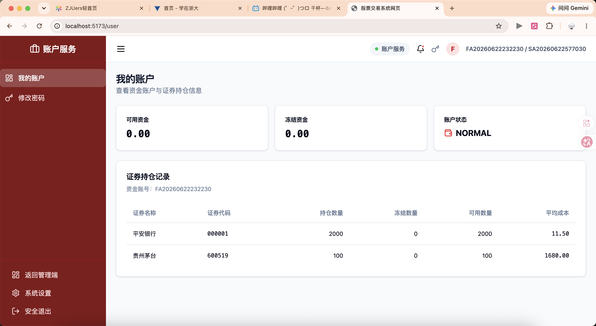
**图2-4-1：查询全部持仓**


### <a name='-1'></a>2.5. 证券账户挂失与补办测试

#### <a name='-1'></a>2.5.1. 测试用例

**测试用例 SEC-LOSS-001**

| 项目 | 内容 |
| --- | --- |
| 测试用例编号 | SEC-LOSS-001 |
| 测试功能 | 证券账户-挂失 |
| 测试标题 | 正常账户挂失 |
| 重要级别 | 高 |
| 预置条件 | 账户状态正常，持有人身份信息可被正确校验。 |
| 输入 | 正确身份证号及挂失申请信息。 |
| 操作步骤 | 1. 进入证券账户挂失页面；<br>2. 输入正确身份证号；<br>3. 提交挂失申请。 |
| 预期输出 | 挂失成功，账户状态变为“挂失冻结”。 |

**测试用例 SEC-LOSS-002**

| 项目 | 内容 |
| --- | --- |
| 测试用例编号 | SEC-LOSS-002 |
| 测试功能 | 证券账户-挂失身份校验 |
| 测试标题 | 身份不匹配挂失 |
| 重要级别 | 高 |
| 预置条件 | 账户存在，但输入的身份信息与账户持有人不一致。 |
| 输入 | 错误身份证号。 |
| 操作步骤 | 1. 进入挂失页面；<br>2. 输入错误身份证号；<br>3. 提交挂失请求。 |
| 预期输出 | 提示“身份信息不匹配”。 |

**测试用例 SEC-REISSUE-001**

| 项目 | 内容 |
| --- | --- |
| 测试用例编号 | SEC-REISSUE-001 |
| 测试功能 | 证券账户-补办 |
| 测试标题 | 挂失后补办 |
| 重要级别 | 高 |
| 预置条件 | 目标证券账户已完成挂失。 |
| 输入 | 挂失账户的补办申请信息。 |
| 操作步骤 | 1. 进入证券账户补办页面；<br>2. 选择已挂失账户；<br>3. 提交补办申请。 |
| 预期输出 | 生成新证券账号，旧账户关闭，持仓迁移。 |

#### <a name='-1'></a>2.5.2. 测试结果

| 用例编号 | 实际输出 | 是否通过 | 图片编号 |
| --- | --- | --- | --- |
| SEC-LOSS-001 | 验证身份后发起挂失，账户状态更新为挂失冻结。 | 通过 | 图2-5-1 |
| SEC-LOSS-002 | 身份信息不匹配时系统拒绝挂失并提示校验失败。 | 通过 | 图2-5-2 |
| SEC-REISSUE-001 | 对挂失账户执行补办后生成新证券账号，旧账户关闭且持仓完成迁移。 | 通过 | 图2-5-3 |

#### <a name='-1'></a>2.5.3. 测试结果分析

挂失与补办功能能够完成账户状态切换、身份校验和新旧账户衔接。异常挂失场景会被拦截，补办后关键资产信息能够迁移，说明该流程具备基本可用性。

#### <a name='-1'></a>2.5.4. 测试结果截图


**图2-5-1：正常账户挂失**


**图2-5-2：身份不匹配挂失**

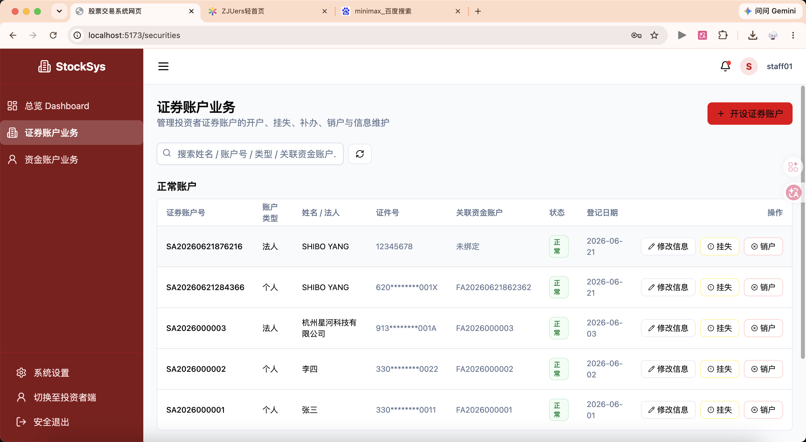
**图2-5-3：挂失后补办**

### <a name='-1'></a>2.6.  证券账户持有人信息修改测试

#### <a name='-1'></a>2.6.1. 测试用例

**测试用例 SEC-INFO-001**

| 项目 | 内容 |
| --- | --- |
| 测试用例编号 | SEC-INFO-001 |
| 测试功能 | 证券账户-持有人信息修改 |
| 测试标题 | 正常修改信息 |
| 重要级别 | 中 |
| 预置条件 | 证券账户存在且处于可维护状态。 |
| 输入 | 新的姓名、电话、地址等资料。 |
| 操作步骤 | 1. 进入持有人信息修改页面；<br>2. 修改姓名、电话、地址等字段；<br>3. 提交保存。 |
| 预期输出 | 修改成功，信息更新显示。 |

**测试用例 SEC-INFO-002**

| 项目 | 内容 |
| --- | --- |
| 测试用例编号 | SEC-INFO-002 |
| 测试功能 | 证券账户-证件唯一性校验 |
| 测试标题 | 证件号重复 |
| 重要级别 | 高 |
| 预置条件 | 系统中已存在其他投资者使用该证件号。 |
| 输入 | 已存在的证件号码。 |
| 操作步骤 | 1. 进入信息修改页面；<br>2. 将证件号修改为系统中已存在的号码；<br>3. 提交保存。 |
| 预期输出 | 提示“该证件号码已被使用”。 |

**测试用例 SEC-INFO-003**

| 项目 | 内容 |
| --- | --- |
| 测试用例编号 | SEC-INFO-003 |
| 测试功能 | 证券账户-年龄规则校验 |
| 测试标题 | 修改为未成年人证件 |
| 重要级别 | 高 |
| 预置条件 | 已进入持有人信息修改页面。 |
| 输入 | 未满 18 周岁的身份证号码。 |
| 操作步骤 | 1. 打开持有人信息修改页面；<br>2. 输入未成年人身份证号；<br>3. 提交保存。 |
| 预期输出 | 提示“投资者未满18周岁”。 |

#### <a name='-1'></a>2.6.2. 测试结果

| 用例编号 | 实际输出 | 是否通过 | 图片编号 |
| --- | --- | --- | --- |
| SEC-INFO-001 | 持有人基础信息修改后页面刷新显示最新信息。 | 通过 | 图2-6-1 |
| SEC-INFO-002 | 修改为重复证件号时系统提示证件号码已被使用，保存失败。 | 通过 | 图2-6-2 |
| SEC-INFO-003 | 修改为未成年人证件信息时系统阻止提交并提示年龄限制。 | 通过 | 图2-6-3 |

#### <a name='-1'></a>2.6.3. 测试结果分析

持有人信息修改功能在正常更新和异常校验场景下表现稳定。系统能够继续执行证件唯一性和年龄规则校验，避免通过修改资料绕过开户阶段的业务限制。

#### <a name='-1'></a>2.6.4. 测试结果截图


**图2-6-1：正常修改信息**


**图2-6-2：证件号重复**

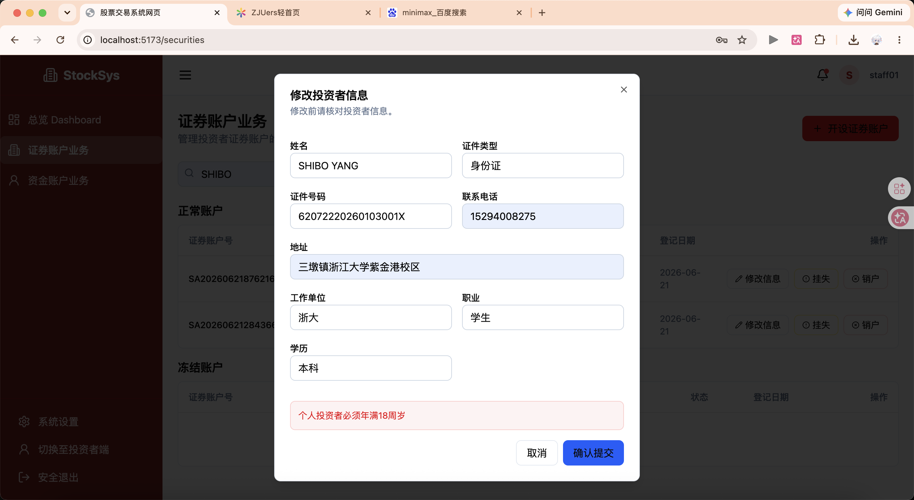

**图2-6-3：修改为未成年人证件**

### <a name='-1'></a>2.7.  证券账户销户测试

#### <a name='-1'></a>2.7.1. 测试用例

**测试用例 SEC-CLOSE-001**

| 项目 | 内容 |
| --- | --- |
| 测试用例编号 | SEC-CLOSE-001 |
| 测试功能 | 证券账户-销户 |
| 测试标题 | 无持仓正常销户 |
| 重要级别 | 高 |
| 预置条件 | 目标证券账户持仓为 0，身份信息可正确校验。 |
| 输入 | 正确身份信息和销户申请。 |
| 操作步骤 | 1. 确保持仓已清零；<br>2. 进入销户页面；<br>3. 输入身份信息并提交销户申请。 |
| 预期输出 | 销户成功，账户状态变为“已销户”。 |

**测试用例 SEC-CLOSE-002**

| 项目 | 内容 |
| --- | --- |
| 测试用例编号 | SEC-CLOSE-002 |
| 测试功能 | 证券账户-销户前置校验 |
| 测试标题 | 有持仓销户 |
| 重要级别 | 高 |
| 预置条件 | 目标证券账户仍存在持仓。 |
| 输入 | 有持仓账户的销户申请。 |
| 操作步骤 | 1. 进入销户页面；<br>2. 对仍有持仓的账户发起销户；<br>3. 提交申请。 |
| 预期输出 | 提示“账户存在持仓，无法销户”。 |

**测试用例 SEC-CLOSE-005**

| 项目 | 内容 |
| --- | --- |
| 测试用例编号 | SEC-CLOSE-005 |
| 测试功能 | 证券账户-销户身份校验 |
| 测试标题 | 身份不匹配销户 |
| 重要级别 | 高 |
| 预置条件 | 目标账户存在，但输入身份信息错误。 |
| 输入 | 错误身份证号。 |
| 操作步骤 | 1. 进入销户页面；<br>2. 输入错误身份证号；<br>3. 提交销户申请。 |
| 预期输出 | 提示“身份信息不匹配”。 |

#### <a name='-1'></a>2.7.2. 测试结果

| 用例编号 | 实际输出 | 是否通过 | 图片编号 |
| --- | --- | --- | --- |
| SEC-CLOSE-001 | 在持仓清零后提交销户申请，账户状态成功更新为已销户。 | 通过 | 图2-7-1 |
| SEC-CLOSE-002 | 持仓未清零时系统拒绝销户并提示存在持仓。 | 通过 | 图2-7-2 |
| SEC-CLOSE-005 | 身份信息校验失败时系统拦截销户操作。 | 通过 | 图2-7-3 |

#### <a name='-1'></a>2.7.3. 测试结果分析

销户功能对持仓状态和身份信息的前置校验较完整。正常销户路径可以顺利完成，异常场景均被系统阻断，符合证券账户销户的基本业务要求。

#### <a name='-1'></a>2.7.4. 测试结果截图

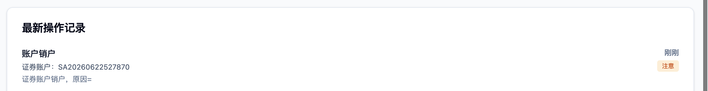

**图2-7-1：无持仓正常销户**

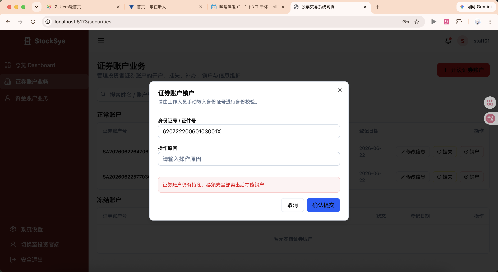

**图2-7-2：有持仓销户**


**图2-7-3：身份不匹配销户**

### <a name='-1'></a>2.8. 资金账户开户与绑定测试

#### <a name='-1'></a>2.8.1. 测试用例

**测试用例 FUND-OPEN-001**

| 项目 | 内容 |
| --- | --- |
| 测试用例编号 | FUND-OPEN-001 |
| 测试功能 | 资金账户-开户与绑定 |
| 测试标题 | 正常开户并绑定证券账户 |
| 重要级别 | 高 |
| 预置条件 | 投资者已存在可绑定的有效证券账户，且尚未绑定资金账户。 |
| 输入 | 完整开户资料和待绑定的证券账户。 |
| 操作步骤 | 1. 进入资金账户开户页面；<br>2. 填写开户资料；<br>3. 选择证券账户并提交。 |
| 预期输出 | 开户成功，显示资金账号，绑定关系建立。 |

**测试用例 FUND-OPEN-002**

| 项目 | 内容 |
| --- | --- |
| 测试用例编号 | FUND-OPEN-002 |
| 测试功能 | 资金账户-绑定必填校验 |
| 测试标题 | 未选择证券账户开户 |
| 重要级别 | 高 |
| 预置条件 | 已进入资金账户开户页面。 |
| 输入 | 开户资料，但不选择证券账户。 |
| 操作步骤 | 1. 填写开户资料；<br>2. 不选择证券账户；<br>3. 直接提交开户申请。 |
| 预期输出 | 提示“请选择要绑定的证券账户”。 |

**测试用例 FUND-OPEN-004**

| 项目 | 内容 |
| --- | --- |
| 测试用例编号 | FUND-OPEN-004 |
| 测试功能 | 资金账户-重复绑定校验 |
| 测试标题 | 重复开户 |
| 重要级别 | 高 |
| 预置条件 | 该证券账户已绑定资金账户。 |
| 输入 | 已绑定证券账户对应的开户资料。 |
| 操作步骤 | 1. 进入开户页面；<br>2. 选择已绑定的证券账户；<br>3. 提交开户申请。 |
| 预期输出 | 提示“该证券账户已绑定资金账户”。 |

#### <a name='-1'></a>2.8.2. 测试结果

| 用例编号 | 实际输出 | 是否通过 | 图片编号 |
| --- | --- | --- | --- |
| FUND-OPEN-001 | 完成资料填写并选择证券账户后，资金账户开户成功且绑定关系建立。 | 通过 | 图2-8-1 |
| FUND-OPEN-002 | 未选择证券账户直接提交时，系统提示必须先选择绑定账户。 | 通过 | 图2-8-2 |
| FUND-OPEN-004 | 已绑定证券账户重复开户时系统拒绝受理并提示不可重复绑定。 | 通过 | 图2-8-3 |

#### <a name='-1'></a>2.8.3. 测试结果分析

资金账户开户与绑定流程能够正确校验证券账户关联关系。正常场景下可完成开户，异常场景下能阻止遗漏绑定或重复绑定，说明账户关联控制逻辑有效。

#### <a name='-1'></a>2.8.4. 测试结果截图


**图2-8-1：正常开户并绑定证券账户**


**图2-8-2：未选择证券账户开户**

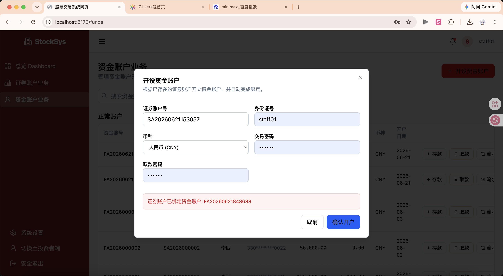

**图2-8-3：重复开户**


### <a name='-1'></a>2.9. 资金账户登录与密码修改测试

#### <a name='-1'></a>2.9.1. 测试用例

**测试用例 FUND-LOGIN-001**

| 项目 | 内容 |
| --- | --- |
| 测试用例编号 | FUND-LOGIN-001 |
| 测试功能 | 资金账户-登录 |
| 测试标题 | 正常登录 |
| 重要级别 | 高 |
| 预置条件 | 资金账户已开通且账号状态正常。 |
| 输入 | 正确资金账号和密码。 |
| 操作步骤 | 1. 打开资金账户登录页；<br>2. 输入正确资金账号；<br>3. 输入正确密码并提交。 |
| 预期输出 | 登录成功，进入账户首页。 |

**测试用例 FUND-LOGIN-002**

| 项目 | 内容 |
| --- | --- |
| 测试用例编号 | FUND-LOGIN-002 |
| 测试功能 | 资金账户-登录认证 |
| 测试标题 | 密码错误 |
| 重要级别 | 高 |
| 预置条件 | 资金账户账号存在且状态正常。 |
| 输入 | 正确资金账号、错误密码。 |
| 操作步骤 | 1. 打开登录页；<br>2. 输入正确资金账号；<br>3. 输入错误密码并提交。 |
| 预期输出 | 提示“账号或密码错误”。 |

**测试用例 FUND-LOGIN-003**

| 项目 | 内容 |
| --- | --- |
| 测试用例编号 | FUND-LOGIN-003 |
| 测试功能 | 资金账户-账号状态控制 |
| 测试标题 | 冻结账户登录 |
| 重要级别 | 高 |
| 预置条件 | 目标资金账户已处于挂失冻结状态。 |
| 输入 | 冻结账户的正确账号和密码。 |
| 操作步骤 | 1. 打开登录页；<br>2. 输入冻结账户账号和密码；<br>3. 提交登录。 |
| 预期输出 | 提示“账户已冻结，无法登录”。 |

**测试用例 FUND-PWD-001**

| 项目 | 内容 |
| --- | --- |
| 测试用例编号 | FUND-PWD-001 |
| 测试功能 | 资金账户-密码修改 |
| 测试标题 | 正常修改密码 |
| 重要级别 | 高 |
| 预置条件 | 用户已成功登录资金账户。 |
| 输入 | 正确原密码和合法新密码。 |
| 操作步骤 | 1. 进入密码修改页面；<br>2. 输入原密码；<br>3. 输入新密码并确认提交。 |
| 预期输出 | 密码修改成功。 |

**测试用例 FUND-PWD-002**

| 项目 | 内容 |
| --- | --- |
| 测试用例编号 | FUND-PWD-002 |
| 测试功能 | 资金账户-密码修改校验 |
| 测试标题 | 原密码错误 |
| 重要级别 | 高 |
| 预置条件 | 用户已登录资金账户。 |
| 输入 | 错误原密码和新密码。 |
| 操作步骤 | 1. 进入密码修改页面；<br>2. 输入错误原密码；<br>3. 输入新密码并提交。 |
| 预期输出 | 提示“原密码错误”。 |

**测试用例 FUND-PWD-003**

| 项目 | 内容 |
| --- | --- |
| 测试用例编号 | FUND-PWD-003 |
| 测试功能 | 资金账户-密码修改校验 |
| 测试标题 | 两次新密码不一致 |
| 重要级别 | 中 |
| 预置条件 | 用户已登录并进入密码修改页面。 |
| 输入 | 两次不一致的新密码。 |
| 操作步骤 | 1. 输入正确原密码；<br>2. 分别输入两次不同的新密码；<br>3. 提交修改。 |
| 预期输出 | 提示“两次输入的密码不一致”。 |


#### <a name='-1'></a>2.9.2. 测试结果

| 用例编号 | 实际输出 | 是否通过 | 图片编号 |
| --- | --- | --- | --- |
| FUND-LOGIN-001 | 输入正确资金账号和密码后成功进入账户首页。 | 通过 | 图2-9-1 |
| FUND-LOGIN-002 | 输入错误密码后系统提示账号或密码错误，未完成登录。 | 通过 | 图2-9-2 |
| FUND-LOGIN-003 | 冻结账户尝试登录时被系统拦截并提示账户已冻结。 | 通过 | 图2-9-3 |
| FUND-PWD-001 | 原密码校验通过后，新密码修改成功并可用于后续登录。 | 通过 | 图2-9-4 |
| FUND-PWD-002 | 原密码错误时系统拒绝修改并提示校验失败。 | 通过 | 图2-9-5 |
| FUND-PWD-003 | 两次新密码不一致时前端提示输入不一致，未提交修改。 | 通过 | 图2-9-6 |

#### <a name='-1'></a>2.9.3. 测试结果分析

资金账户登录和密码管理功能在正常与异常场景下均能按预期工作。系统对账户状态、密码正确性和输入一致性做了多层校验，能够降低未授权登录和误修改风险。

#### <a name='-1'></a>2.9.4. 测试结果截图

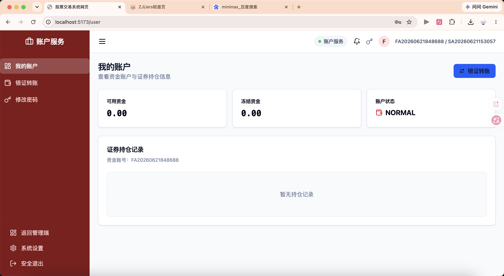

**图2-9-1：正常登录**

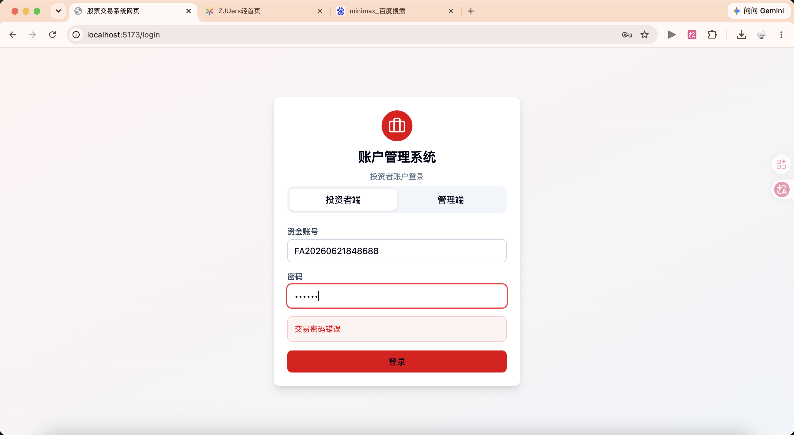

**图2-9-2：密码错误**

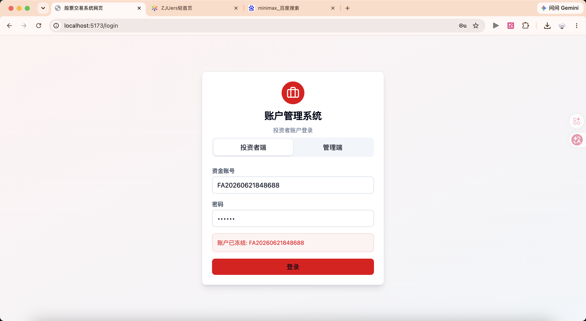

**图2-9-3：冻结账户登录**


**图2-9-4：正常修改密码**


**图2-9-5：原密码错误**

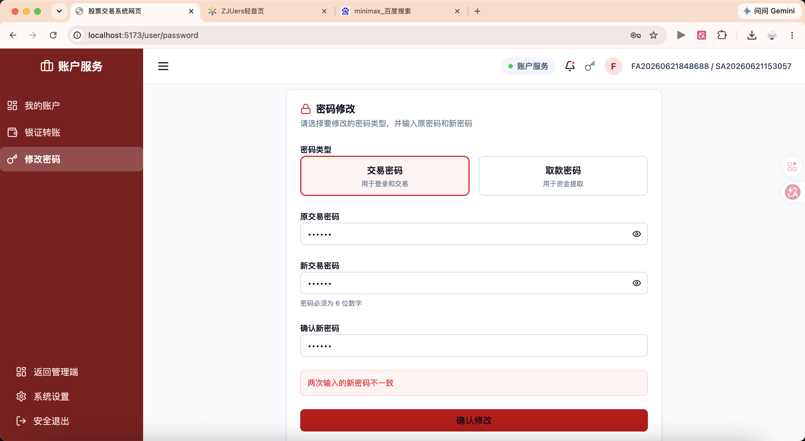

**图2-9-6：两次新密码不一致**

### <a name='-1'></a>2.10. 资金账户存取款测试

#### <a name='-1'></a>2.10.1. 测试用例

**测试用例 FUND-DEP-001**

| 项目 | 内容 |
| --- | --- |
| 测试用例编号 | FUND-DEP-001 |
| 测试功能 | 资金账户-存款 |
| 测试标题 | 正常存款 |
| 重要级别 | 高 |
| 预置条件 | 资金账户状态正常，可进行资金操作。 |
| 输入 | 合法存款金额。 |
| 操作步骤 | 1. 进入存款页面；<br>2. 输入存款金额；<br>3. 确认提交。 |
| 预期输出 | 存款成功，余额增加。 |

**测试用例 FUND-WITH-001**

| 项目 | 内容 |
| --- | --- |
| 测试用例编号 | FUND-WITH-001 |
| 测试功能 | 资金账户-取款 |
| 测试标题 | 正常取款 |
| 重要级别 | 高 |
| 预置条件 | 资金账户可用余额充足。 |
| 输入 | 小于账户余额的取款金额。 |
| 操作步骤 | 1. 进入取款页面；<br>2. 输入取款金额；<br>3. 确认提交。 |
| 预期输出 | 取款成功，余额减少。 |

**测试用例 FUND-WITH-002**

| 项目 | 内容 |
| --- | --- |
| 测试用例编号 | FUND-WITH-002 |
| 测试功能 | 资金账户-取款余额校验 |
| 测试标题 | 余额不足取款 |
| 重要级别 | 高 |
| 预置条件 | 账户余额小于待取款金额。 |
| 输入 | 超过账户余额的取款金额。 |
| 操作步骤 | 1. 进入取款页面；<br>2. 输入超过账户余额的金额；<br>3. 提交取款请求。 |
| 预期输出 | 提示“余额不足”。 |

**测试用例 FUND-DEP-002**

| 项目 | 内容 |
| --- | --- |
| 测试用例编号 | FUND-DEP-002 |
| 测试功能 | 资金账户-存款金额校验 |
| 测试标题 | 负数金额存款 |
| 重要级别 | 中 |
| 预置条件 | 已进入存款页面。 |
| 输入 | 负数存款金额。 |
| 操作步骤 | 1. 打开存款页面；<br>2. 输入负数金额；<br>3. 触发表单校验或提交。 |
| 预期输出 | 表单校验提示“金额必须大于0”。 |

**测试用例 FUND-WITH-003**

| 项目 | 内容 |
| --- | --- |
| 测试用例编号 | FUND-WITH-003 |
| 测试功能 | 资金账户-取款金额校验 |
| 测试标题 | 负数金额取款 |
| 重要级别 | 中 |
| 预置条件 | 已进入取款页面。 |
| 输入 | 负数取款金额。 |
| 操作步骤 | 1. 打开取款页面；<br>2. 输入负数金额；<br>3. 触发表单校验或提交。 |
| 预期输出 | 表单校验提示“金额必须大于0”。 |


#### <a name='-1'></a>2.10.2. 测试结果

| 用例编号 | 实际输出 | 是否通过 | 图片编号 |
| --- | --- | --- | --- |
| FUND-DEP-001 | 输入合法金额后存款成功，账户余额同步增加。 | 通过 | 图2-10-1 |
| FUND-WITH-001 | 输入小于可用余额的取款金额后取款成功，余额正确减少。 | 通过 | 图2-10-2 |
| FUND-WITH-002 | 余额不足时系统拒绝取款并给出余额不足提示。 | 通过 | 图2-10-3 |
| FUND-DEP-002 | 输入负数金额时表单直接拦截，禁止发起存款。 | 通过 | 图2-10-4 |
| FUND-WITH-003 | 输入负数金额时表单直接拦截，禁止发起取款。 | 通过 | 图2-10-5 |

#### <a name='-1'></a>2.10.3. 测试结果分析

存取款功能能够正确处理余额变动和金额合法性校验。正常交易路径下余额更新符合预期，异常金额与余额不足场景均被及时阻断，账户资金处理逻辑基本可靠。

#### <a name='-1'></a>2.10.4. 测试结果截图


**图2-10-1：正常存款**

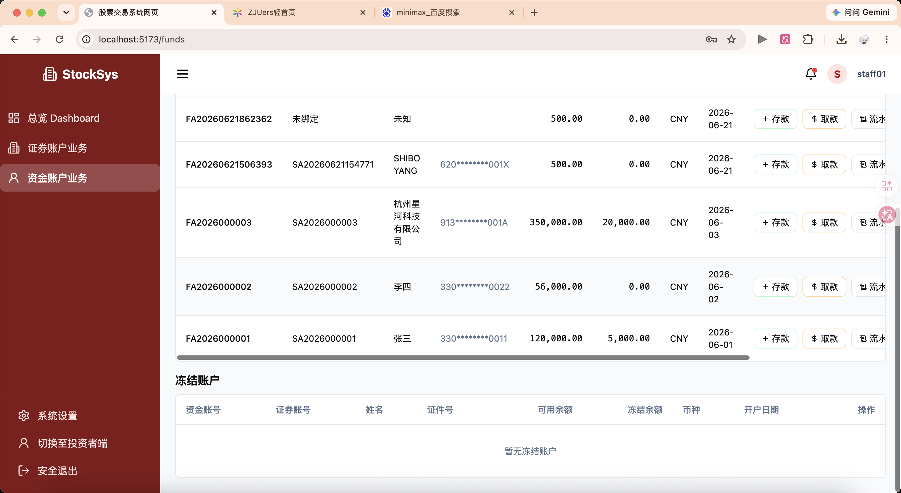

**图2-10-2：正常取款**


**图2-10-3：余额不足取款**

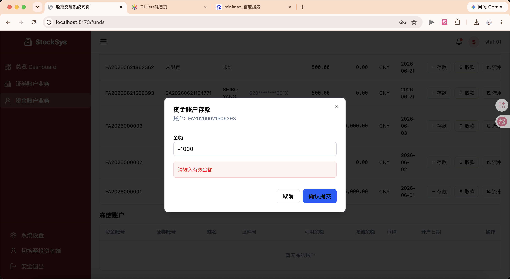

**图2-10-4：负数金额存款**

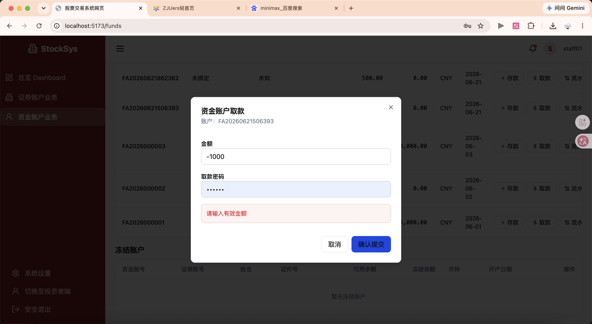

**图2-10-5：负数金额取款**

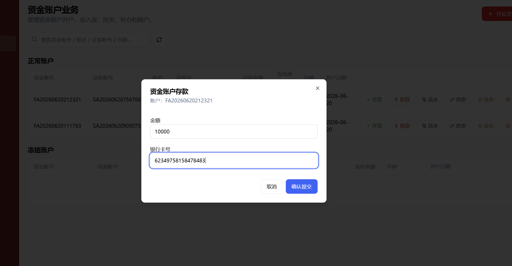

**图2-10-6：加银行卡号后的存款**

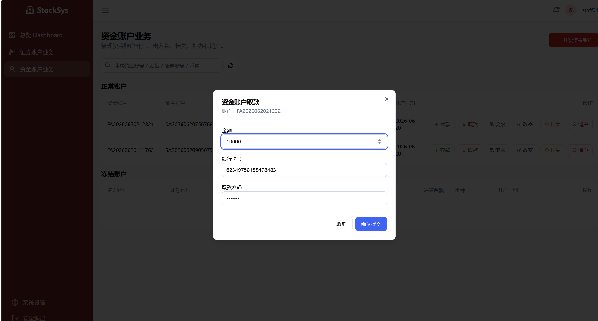

**图2-10-7：加银行卡号后的取款**

### <a name='-1'></a>2.11. 资金账户挂失、补办与销户测试

#### <a name='-1'></a>2.11.1. 测试用例

**测试用例 FUND-LOSS-001**

| 项目 | 内容 |
| --- | --- |
| 测试用例编号 | FUND-LOSS-001 |
| 测试功能 | 资金账户-挂失 |
| 测试标题 | 正常挂失 |
| 重要级别 | 高 |
| 预置条件 | 资金账户状态正常，持有人身份可被正确验证。 |
| 输入 | 正确身份信息和挂失申请。 |
| 操作步骤 | 1. 进入资金账户挂失页面；<br>2. 完成身份验证；<br>3. 提交挂失申请。 |
| 预期输出 | 挂失成功，账户冻结。 |

**测试用例 FUND-REISSUE-001**

| 项目 | 内容 |
| --- | --- |
| 测试用例编号 | FUND-REISSUE-001 |
| 测试功能 | 资金账户-补办 |
| 测试标题 | 挂失后补办 |
| 重要级别 | 高 |
| 预置条件 | 目标资金账户已完成挂失。 |
| 输入 | 挂失账户补办申请信息。 |
| 操作步骤 | 1. 进入补办页面；<br>2. 选择已挂失账户；<br>3. 提交补办申请。 |
| 预期输出 | 生成新资金账号，余额迁移。 |

**测试用例 FUND-CLOSE-002**

| 项目 | 内容 |
| --- | --- |
| 测试用例编号 | FUND-CLOSE-002 |
| 测试功能 | 资金账户-销户前置校验 |
| 测试标题 | 有余额销户 |
| 重要级别 | 高 |
| 预置条件 | 目标资金账户仍存在余额。 |
| 输入 | 有余额账户的销户申请。 |
| 操作步骤 | 1. 进入销户页面；<br>2. 对余额未清零账户发起销户；<br>3. 提交申请。 |
| 预期输出 | 提示“账户余额不为0，无法销户”。 |

#### <a name='-1'></a>2.11.2. 测试结果

| 用例编号 | 实际输出 | 是否通过 | 图片编号 |
| --- | --- | --- | --- |
| FUND-LOSS-001 | 身份验证通过后挂失成功，账户状态更新为冻结。 | 通过 | 图2-11-1 |
| FUND-REISSUE-001 | 对挂失账户执行补办后生成新资金账号，原账户余额完成迁移。 | 通过 | 图2-11-2 |
| FUND-CLOSE-002 | 账户存在余额时系统拒绝销户并提示需先清零余额。 | 通过 | 图2-11-3 |

#### <a name='-1'></a>2.11.3. 测试结果分析

资金账户在挂失、补办和销户控制方面实现了基本业务闭环。系统既能完成挂失后的恢复处理，也能在销户前校验账户余额状态，业务限制符合预期。

#### <a name='-1'></a>2.11.4. 测试结果截图


**图2-11-1：正常挂失**

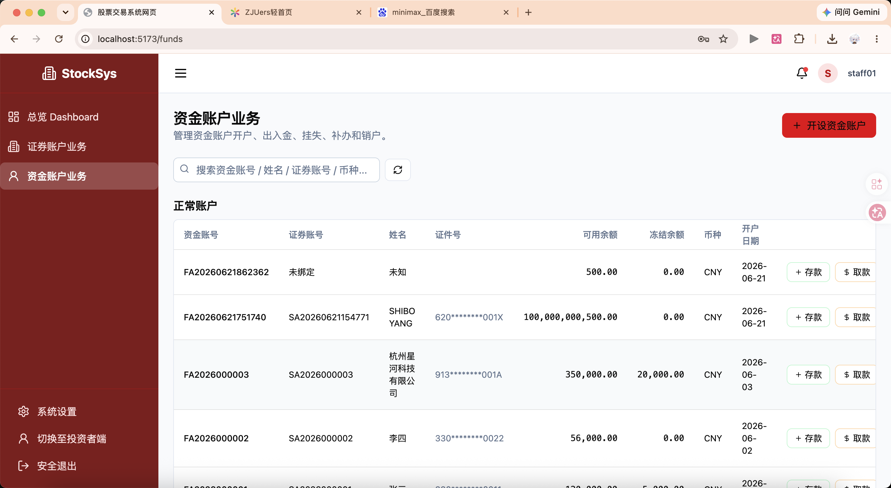

**图2-11-2：挂失后补办**

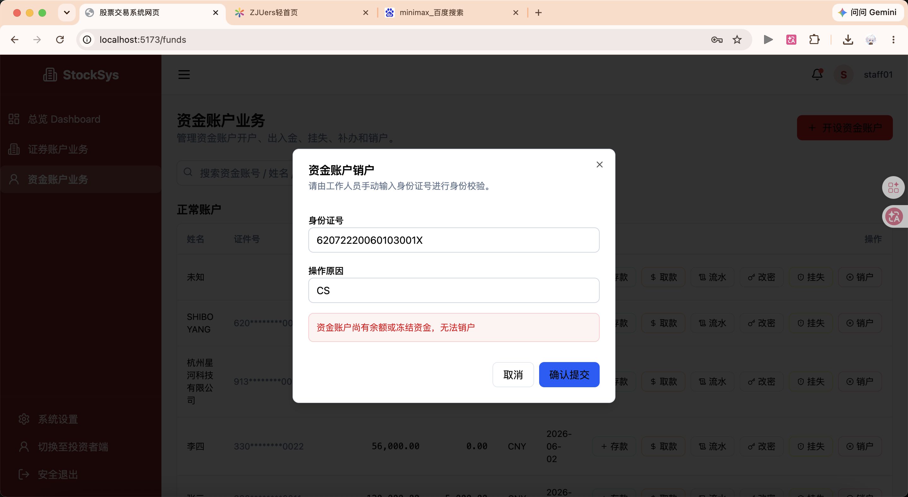

**图2-11-3：有余额销户**

### <a name='-1'></a>2.12. 资金账户活期利息测试

#### <a name='-1'></a>2.12.1. 测试用例

**测试用例 FUND-INT-001**

| 项目 | 内容 |
| --- | --- |
| 测试用例编号 | FUND-INT-001 |
| 测试功能 | 资金账户-活期利息计算 |
| 测试标题 | 利息计算 |
| 重要级别 | 中 |
| 预置条件 | 资金账户存在余额并已产生活期利息。 |
| 输入 | 无额外输入。 |
| 操作步骤 | 1. 登录资金账户，进入利息明细页面；<br>2. 查看利息计算结果。 |
| 预期输出 | 显示按日计算的活期利息。 |

**测试用例 FUND-INT-002**

| 项目 | 内容 |
| --- | --- |
| 测试用例编号 | FUND-INT-002 |
| 测试功能 | 资金账户-活期利息入账 |
| 测试标题 | 利息入账 |
| 重要级别 | 中 |
| 预置条件 | 系统已执行利息结算并生成入账记录。 |
| 输入 | 无额外输入。 |
| 操作步骤 | 1. 登录资金账户；<br>2. 进入利息或流水记录页面；<br>3. 查询利息入账记录。 |
| 预期输出 | 显示利息自动入账记录。 |

#### <a name='-1'></a>2.12.2. 测试结果

| 用例编号 | 实际输出 | 是否通过 | 图片编号 |
| --- | --- | --- | --- |
| FUND-INT-001 | 利息明细页可展示按日累计的活期利息计算结果。 | 通过 | 图2-12-1 |
| FUND-INT-002 | 利息入账记录中可查询到系统自动生成的入账流水。 | 通过 | 图2-12-2 |

#### <a name='-1'></a>2.12.3. 测试结果分析

活期利息功能已实现利息计算展示和入账记录查询两个基本能力。测试结果表明，系统能够保留利息累计过程和对应流水，满足基础的利息查询需求。

#### <a name='-1'></a>2.12.4. 测试结果截图


**图2-12-1：日结息**

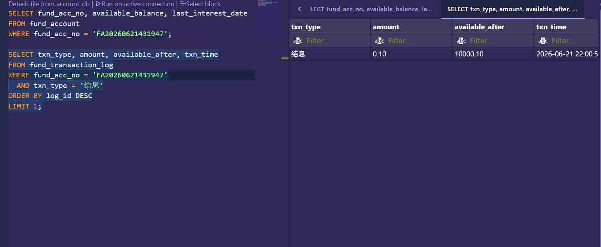

**图2-12-2：入账**


<div STYLE="page-break-after: always;"></div>

## <a name='-1'></a>3. 边界值与基路径测试

### <a name='-1'></a>3.1. 测试用例


| 用例编号  | 测试场景                   | 操作步骤                                                     | 预期结果                                                     | 图片编号 |
| --------- | -------------------------- | ------------------------------------------------------------ | ------------------------------------------------------------ | -------- |
| BOUND-001 | 单项开户信息为空           | 不填写姓名提交开户                                           | 表单提示"请填写完整的开户信息"                               | 图5-1    |
| BOUND-002 | 存款金额为0                | 输入0元存款                                                  | 提示"请输入有效金额"                                         | 图5-2    |
| BOUND-003 | 取款金额等于可用余额       | 账户可用余额为 `100.00` 时输入 `100.00` 取款                 | 取款成功，账户可用余额变为 `0.00`                            | 图5-3    |
| BOUND-004 | 安全证书验证码错一位       | 输入"CERT-123455"                                            | 提示"安全证书认证码错误"                                     | 图5-6    |
| BOUND-005 | 证书码前后空格容错         | 首次登录后在证书页输入 ` CERT-123456 `                       | 认证成功，系统正常签发 token 并进入业务页                    | 图5-7    |
| BOUND-006 | SQL注入尝试                | 用用户名tradeadmin'与错误密码登录系统                        | 提示"工作人员不存在或密码错误"                               | 图5-8    |
| BOUND-007 | XSS攻击尝试                | 输入框中输入脚本代码                                         | 系统正常处理，不弹窗、不执行脚本                             | 图5-9    |
| BOUND-008 | 资金回调幂等边界           | 对同一 `fundAccNo + refOrderId + txnType` 连续发送两次完全相同的资金回调 | 首次成功更新余额；第二次返回重复标记，不重复扣减/冻结，不新增第二条资金流水 | 图5-11   |
| BOUND-009 | 持仓回调幂等边界           | 对同一 `secAccNo + stockCode + refOrderId + changeType` 连续发送两次完全相同的持仓回调 | 首次成功更新持仓；第二次返回重复标记，不重复改写持仓，不新增第二条持仓流水 | 图5-14   |
| BOUND-010 | 卖出冻结等于可卖数量       | 持仓 `quantity=200`、`frozenQuantity=50`，发起 `quantity=150` 的卖出冻结 | 冻结成功，`availableQuantity=0`，`frozenQuantity=200`        | 图5-16   |
| BOUND-011 | 资金账户补办迁移总额边界   | 旧资金账户处于挂失冻结，`available=300.00`、`frozen=200.00`，执行补办 | 新资金账户可用余额为 `500.00`、冻结余额为 `0.00`；旧账户余额清零并置为已销户；关联证券账户恢复正常绑定 | 图5-19   |
| BOUND-012 | 证券账户补办迁移总持仓边界 | 旧证券账户处于挂失冻结，某股票 `quantity=0`、`frozenQuantity=60`，执行补办 | 新证券账户该股票持仓变为 `quantity=60`、`frozenQuantity=0`；旧账户持仓清空并置为已销户 | 图5-25   |
| BOUND-013 | 年度结息零天差路径         | `last_interest_date` 等于测试当天，再执行年度结息            | 不重复计息，不新增利息流水，`last_interest_date` 保持不变    | 图5-31   |
| BOUND-014 | 年度结息1天差舍入路径      | `available=10000.00`、年利率 `0.0035`、`last_interest_date` 为前一天，执行年度结息 | 本次利息为 `0.10`，账户余额更新为 `10000.10`，并写入一条利息流水 | 图5-35   |

### <a name='-1'></a>3.2. 实验结果

本次边界值与异常测试覆盖开户表单、资金存取、身份认证、输入安全、外部交易回调、账户补办迁移和年度结息等场景。BOUND-001 至 BOUND-014 均按预设步骤完成，实际输出与预期结果一致，测试结论均为通过。

| 用例编号  | 实际输出                                                     | 是否符合预期 | 测试结果 |
| --------- | ------------------------------------------------------------ | ------------ | -------- |
| BOUND-001 | 开户姓名为空时系统阻止提交，并提示需要填写完整开户信息。     | 符合         | 通过     |
| BOUND-002 | 存款金额输入 `0` 时，系统提示请输入有效金额，未产生资金流水。 | 符合         | 通过     |
| BOUND-003 | 当可用余额为 `100.00` 时发起 `100.00` 取款，取款成功，账户可用余额扣减至 `0.00`。 | 符合         | 通过     |
| BOUND-004 | 输入错误一位的安全证书认证码后，系统拒绝认证并提示认证码错误。 | 符合         | 通过     |
| BOUND-005 | 输入前后带空格的 ` CERT-123456 ` 后，系统完成去空格处理，认证成功并签发 token。 | 符合         | 通过     |
| BOUND-006 | 使用带单引号的用户名尝试登录时，系统按普通字符串处理并返回登录失败提示，未绕过认证。 | 符合         | 通过     |
| BOUND-007 | 在输入框中提交脚本内容后，页面未弹窗，脚本未执行，系统按普通输入内容处理。 | 符合         | 通过     |
| BOUND-008 | 连续两次提交相同资金回调时，首次回调更新余额，第二次回调被识别为重复请求，未重复扣减或冻结资金。 | 符合         | 通过     |
| BOUND-009 | 连续两次提交相同持仓回调时，首次回调更新持仓，第二次回调返回重复标记，未新增重复持仓流水。 | 符合         | 通过     |
| BOUND-010 | 在可卖数量刚好等于冻结数量时执行卖出冻结，系统成功冻结，最终可用数量为 `0`，冻结数量为 `200`。 | 符合         | 通过     |
| BOUND-011 | 挂失冻结资金账户补办后，新资金账户承接旧账户总额 `500.00`，冻结余额清零，旧账户清零并置为已销户。 | 符合         | 通过     |
| BOUND-012 | 挂失冻结证券账户补办后，冻结持仓迁移至新证券账户并恢复为可用持仓，旧账户持仓清空并置为已销户。 | 符合         | 通过     |
| BOUND-013 | `last_interest_date` 为测试当天时执行年度结息，系统未重复计息，未新增利息流水，日期保持不变。 | 符合         | 通过     |
| BOUND-014 | `last_interest_date` 为前一天且余额为 `10000.00` 时执行年度结息，系统计算利息 `0.10`，余额更新为 `10000.10` 并写入利息流水。 | 符合         | 通过     |

### <a name='-1'></a>3.3. 测试结果分析

从测试结果看，账户管理子系统对基础输入边界和业务边界均能进行有效控制。开户信息缺失、存款金额为 `0`、错误安全证书码等非法输入会被前端或后端校验逻辑拦截，未继续进入后续业务流程；取款金额等于账户可用余额这一临界场景能够正常完成，说明资金扣减逻辑允许合法的边界值，并能正确处理余额归零状态。

在异常输入与安全输入方面，SQL 注入尝试和 XSS 脚本输入均未造成越权登录、脚本执行或页面异常。系统将异常字符作为普通输入处理，登录认证仍按账号密码校验结果返回，页面渲染也未执行脚本内容，说明当前输入处理和展示路径能够覆盖常见恶意输入场景。

交易回调相关测试主要验证幂等边界。BOUND-008 和 BOUND-009 的结果表明，资金回调和持仓回调都能基于业务唯一键识别重复请求。同一 `refOrderId` 及相同业务类型的重复调用不会重复生成资金流水或持仓流水，也不会造成余额、冻结金额、持仓数量的二次改写，能够避免交易系统重试带来的重复记账风险。

账户补办迁移测试覆盖了挂失冻结状态下的资金和证券账户迁移边界。资金账户补办时，旧账户的可用余额与冻结余额能够合并迁移到新账户，并同步完成旧账户清零、销户以及证券账户绑定恢复；证券账户补办时，冻结持仓能够迁移为新账户的可用持仓，旧账户数据被清理，说明补办流程中的状态流转、余额迁移、持仓迁移和绑定关系更新保持一致。

年度结息测试覆盖了零天差和一天差两个关键路径。零天差场景不会重复产生利息或流水，避免了同一日期重复结息；一天差场景能够按照年利率与天数计算利息，并将 `0.0959...` 的计算结果按规则舍入为 `0.10`，最终更新账户余额并记录利息流水。该结果说明利息计算、舍入处理和入账流程符合预期。

综上，BOUND-001 至 BOUND-014 的实际结果全部符合预定结果。本轮边界值与异常测试未发现影响账户开户、资金变更、交易回调、补办迁移和年度结息的异常缺陷，相关业务规则可以支撑后续接口联调和回归测试。

### <a name='-1'></a>3.4. 测试结果截图

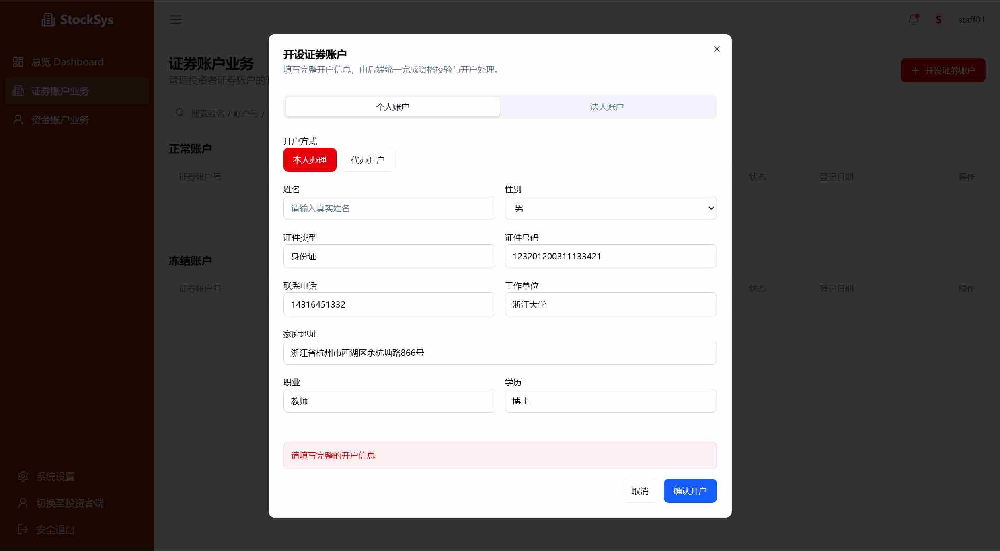
**图3-1：单项开户信息为空**

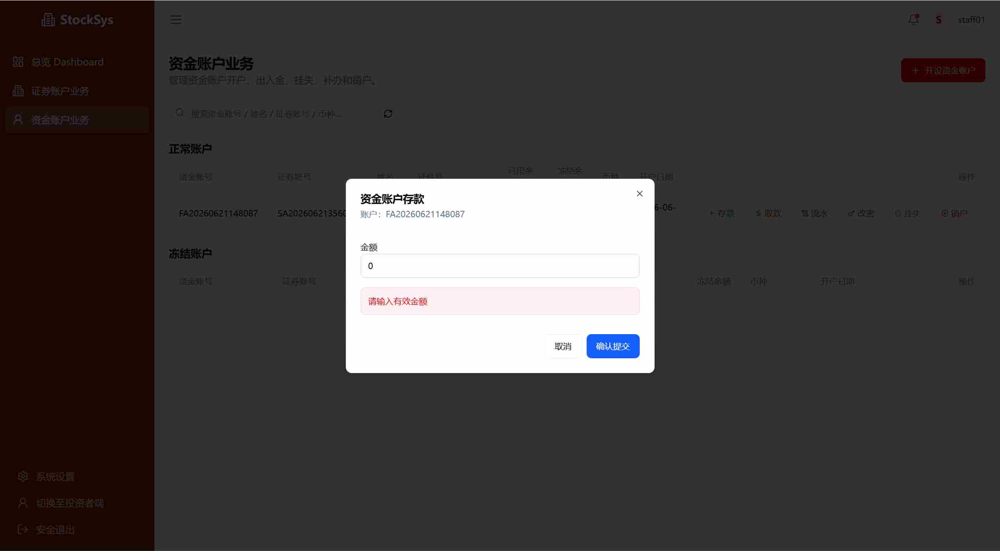
**图3-2：存款金额为0**

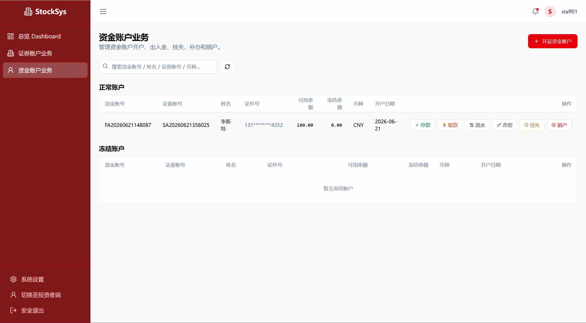
**图3-3：取款金额等于可用余额（1)**

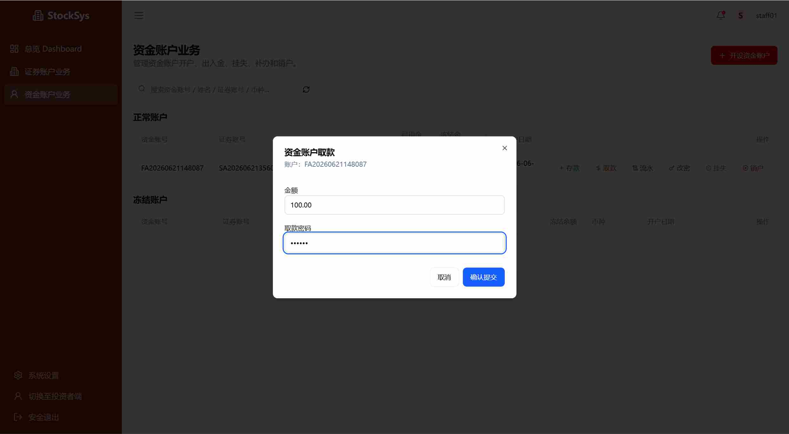
**图3-4：取款金额等于可用余额（2)**


**图3-5：取款金额等于可用余额（3)**


**图3-6：安全证书验证码错一位**

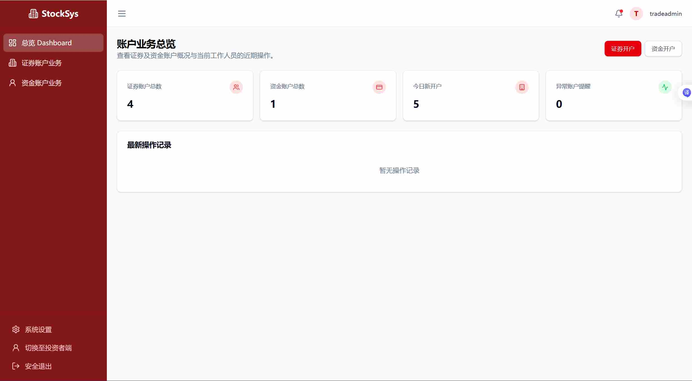
**图3-7：证书码前后空格容错**

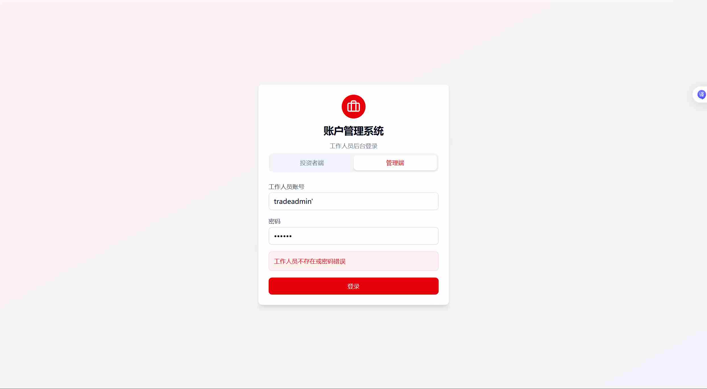
**图3-8：SQL注入尝试**


**图3-9：XSS攻击尝试（1)**

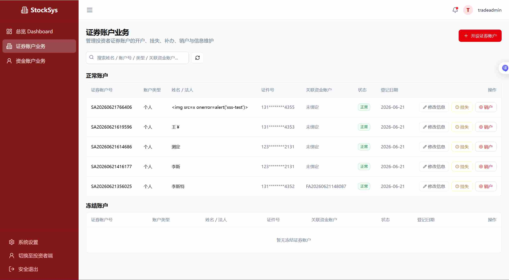
**图3-10：XSS攻击尝试（2)**


**图3-11：资金回调幂等边界（1)**

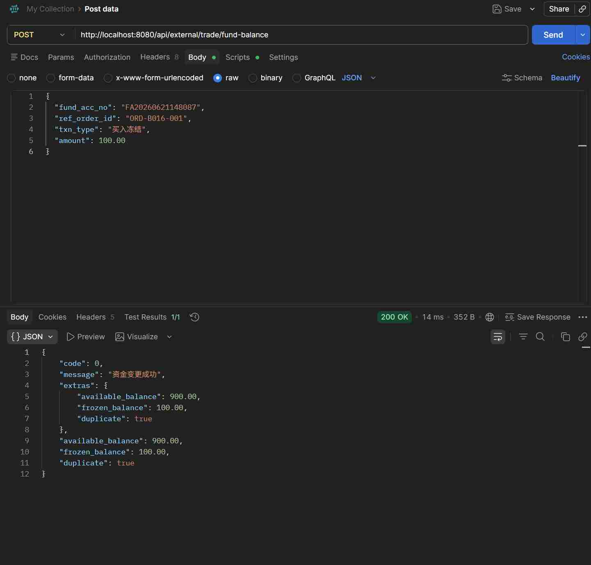
**图3-12：资金回调幂等边界（2)**


**图3-13：资金回调幂等边界（3)**

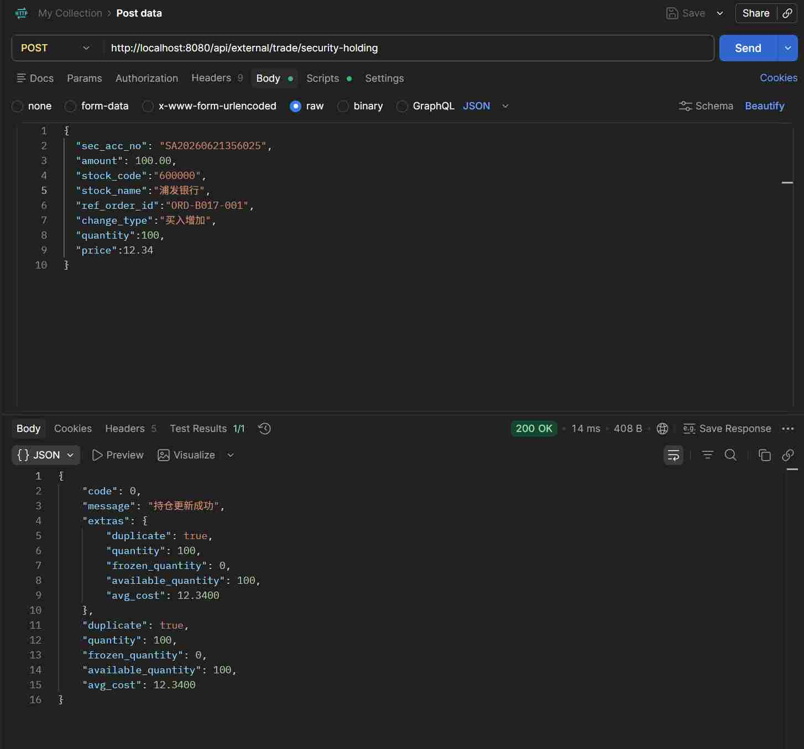
**图3-14：持仓回调幂等边界（1)**


**图3-15：持仓回调幂等边界（2)**


**图3-16：卖出冻结等于可卖数量（1)**

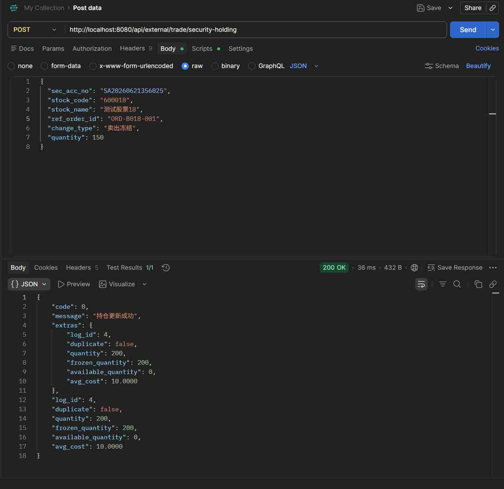
**图3-17：卖出冻结等于可卖数量（2)**


**图3-18：卖出冻结等于可卖数量（3)**

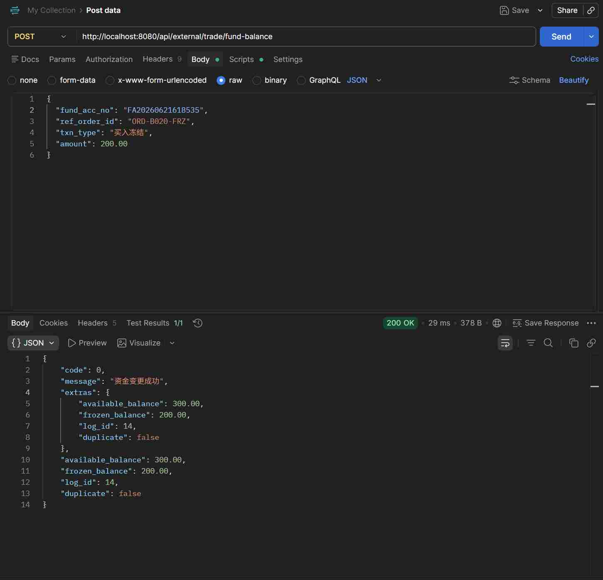
**图3-19：资金账户补办迁移总额边界（1)**

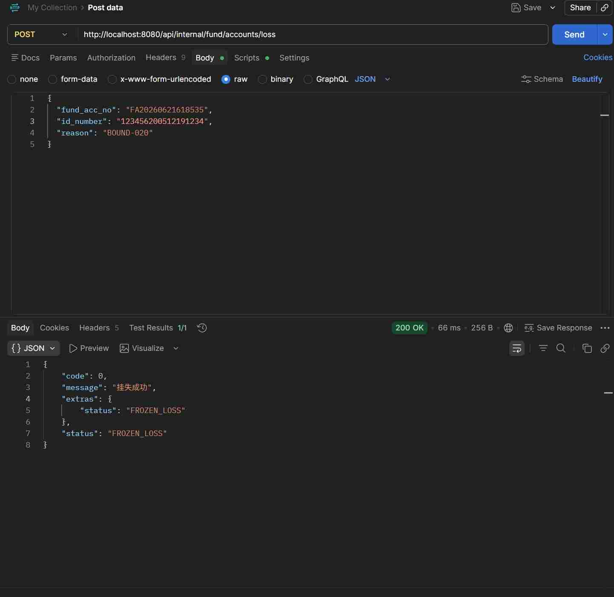
**图3-20：资金账户补办迁移总额边界（2)**


**图3-21：资金账户补办迁移总额边界（3)**


**图3-22：资金账户补办迁移总额边界（4)**


**图3-23：资金账户补办迁移总额边界（5)**


**图3-24：证券账户补办迁移总持仓边界（1)**


**图3-25：证券账户补办迁移总持仓边界（2)**


**图3-26：证券账户补办迁移总持仓边界（3)**


**图3-27：证券账户补办迁移总持仓边界（4)**

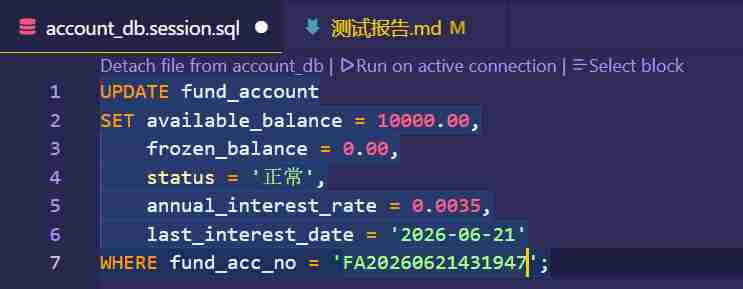
**图3-28：证券账户补办迁移总持仓边界（5)**


**图3-29：证券账户补办迁移总持仓边界（6)**


**图3-30：年度结息零天差路径（1)**


**图3-31：年度结息零天差路径（2)**


**图3-32：年度结息零天差路径（3)**


**图3-33：年度结息零天差路径（4)**


**图3-34：年度结息1天差舍入路径（1)**

## <a name='-1'></a>4. 压力测试

### <a name='-1'></a>4.1. 测试简介

本次压力测试针对账户管理子系统后端接口进行，目标是验证系统在真实 MySQL 数据库环境下的并发稳定性、重复回调幂等性以及混合查询场景下的性能表现。

本轮测试覆盖 4 个场景：

- 并发开户链路
- 重复资金回调幂等
- 重复持仓回调幂等
- 混合并发查询

测试重点包括：

- 在固定并发度与固定任务数下观察成功率与失败率
- 记录平均耗时、P95、P99、吞吐量等性能指标
- 对幂等场景回查数据库，确认最终只落 1 条有效业务记录
- 对失败场景分析错误类型与根因

### <a name='-1'></a>4.2. 控制

本次压力测试主要用到了一些自动化测试工具及对应的辅助工具，包括测试工具 `JUnit 5`、`Spring MockMvc`、`Maven Surefire`，以及辅助工具 `PowerShell`、`MySQL 8.0`、`Python(Pillow)`。

本次测试过程中的主要控制条件如下：

- 测试主机保持不变，测试期间不切换运行环境
- 数据库固定为 `MySQL 8.0 (127.0.0.1:3306/account_db_pressure)`
- 每次压力测试前均重建表结构并重新灌入基础 staff 数据，避免历史数据干扰
- 每个场景的并发度、总任务数、样例类型固定不变
- 幂等测试中的 `ref_order_id` 保持固定，用于验证重复请求识别逻辑
- 混合查询场景固定为 5 类查询接口均匀分布，共 400 次请求

### <a name='-1'></a>4.3. 输入

本次压力测试输入包括测试脚本、场景参数和样例负载，均已归档在 `PressTest/` 目录中。

| 输入项       | 内容                                                | 说明                                               |
| ------------ | --------------------------------------------------- | -------------------------------------------------- |
| 压测入口脚本 | `PressTest/run-pressure-tests.ps1`                  | 负责切换 H2 / MySQL 模式并执行 `PressureTestSuite` |
| 压测主类     | `src/test/java/account/perf/PressureTestSuite.java` | 定义并发度、任务数、目标接口及结果统计逻辑         |
| 场景定义     | `PressTest/scenario-config.json`                    | 记录 4 个压测场景及通过标准                        |
| 样例负载     | `PressTest/samples/*.json`                          | 记录开户、资金回调、持仓回调的样例请求结构         |

辅助工具设置如下：

- PowerShell 执行命令：

```powershell
powershell -ExecutionPolicy Bypass -File .\PressTest\run-pressure-tests.ps1 `
  -DbMode mysql `
  -MysqlHost 127.0.0.1 `
  -MysqlPort 3306 `
  -MysqlDatabase account_db_pressure `
  -MysqlUsername TestAccount `
  -MysqlPassword TestOfAccountManagement
```

- MySQL 参数：
  - 主机：`127.0.0.1`
  - 端口：`3306`
  - 数据库：`account_db_pressure`
  - 用户：`TestAccount`
- 截图整理工具：`Python(Pillow)`，用于生成压测结果总表截图与失败摘要截图

### <a name='-1'></a>4.4. 测试结果

#### <a name='-1'></a>4.4.1. 测试结果数据

| 场景             | 并发度 | 任务数 | 成功 | 失败 | 平均耗时(ms) | P95(ms) | P99(ms) | 吞吐(op/s) | 校验结论 |
| ---------------- | -----: | -----: | ---: | ---: | -----------: | ------: | ------: | ---------: | -------- |
| 并发开户链路     |     10 |     30 |   30 |    0 |        71.97 |     131 |     131 |     136.99 | 通过     |
| 重复资金回调幂等 |     24 |    120 |  120 |    0 |        36.85 |      80 |      88 |     606.06 | 通过     |
| 重复持仓回调幂等 |     24 |    120 |  120 |    0 |        41.22 |      71 |      81 |     545.45 | 通过     |
| 混合并发查询     |     40 |    400 |  385 |   15 |      1020.33 |    3495 |    4409 |      37.38 | 未通过   |

结果分析：

- 并发开户链路、重复资金回调幂等、重复持仓回调幂等 3 个场景均通过校验
- 混合并发查询在真实 MySQL 环境下未通过，共出现 15 次失败请求
- 失败场景的核心报错为数据库连接建立失败，典型报错链包括 `CommunicationsException` 与 `BindException: Address already in use: connect`
- 结合代码路径分析，失败根因不是 SQL 语法问题，是：
  - DAO 层未使用连接池，查询时通过 `DriverManager.getConnection(...)` 即时建连
  - `Dashboard / 账户列表` 路径存在逐条补查关联数据的模式，会把单次查询放大成多次数据库访问
  - 在 `40` 并发、`400` 总请求的混合查询场景下，短时间大量建连触发客户端侧 socket/临时端口资源耗尽

#### <a name='-1'></a>4.4.2. 测试数据截图


**图4-1：压力测试结果汇总截图**


**图4-2：混合并发查询失败摘要截图**

<div STYLE="page-break-after: always;"></div>

## <a name='-1'></a>5. 接口联调测试

### <a name='-1'></a>5.1. 测试简介

验证本子系统与其他子系统的接口对接是否正常。

### <a name='-1'></a>5.2. 测试对象说明

本测试的目的主要是测试本子系统与其他子系统的接口是否完好，能否最后实现集成测试。因为采用的是以数据为中心的体系结构风格，所以与其他子系统的接口测试最终主要集中在与数据库的接口测试上。项目具体信息存放在数据库中，前端通过后端接口从数据库中读取信息，以及从请求中获取登陆状态，实现与其他子系统的交互。

本子系统与其他子系统接口测试将主要测试与数据库的交互能否顺利进行以及用户登录信息能否正确从请求中获取。

- 与交易客户端的接口：
  - 密码修改接口
  - 账户信息快照接口
  - 资金与持仓修改接口
- 与交易管理系统组的接口
  - 创建账户黑名单查询接口

### <a name='-1'></a>5.3. 控制

本子系统根据未登录用户、投资者、普通工作人员和管理员进行访问控制。若用户未登录，则无法进入投资者端或工作人员端的任何业务模块；若已以投资者身份登录并通过证书认证，则只能查看本人的资金账户快照、证券账户和持仓信息，以及修改本人的交易密码或取款密码，不能访问工作人员管理模块；若已以普通工作人员身份登录并通过证书认证，则可以访问仪表盘、证券账户和资金账户管理模块，执行开户、查询、资料修改、挂失、补办、销户、存取款和密码修改等操作；若以管理员 `tradeadmin` 身份登录，则还可以调用管理接口，执行账户冻结、解冻、强制销户和年度结息等操作。

本子系统在证券账户和资金账户开立前，需要从交易管理子系统的黑名单查询接口获取投资者的黑名单状态，黑名单命中时拒绝开户。投资者、证券账户、资金账户、密码哈希、资金流水和操作日志等信息由本子系统统一管理。本子系统向证券交易客户端提供登录认证、资金账户快照和证券持仓快照，并接收交易子系统在委托、成交和撤单后发送的资金及持仓变更信息，以保证不同子系统中的账户数据一致。

本次测试，我们主要关注本子系统与其他子系统的接口调用和交互是否正常：

控制操作顺序：

1. 使用黑名单内的投资者资料尝试创建证券账户，观察本子系统能否正确获取黑名单校验结果，预期开户请求失败且不会创建投资者和证券账户数据。
2. 使用有效资金账户登录交易客户端，尝试修改交易密码，预期修改成功，旧密码失效且新密码可正常使用。
3. 由交易客户端发起买入委托并请求冻结相应资金，预期资金冻结成功，可用资金减少且冻结资金增加相同金额。
4. 由交易客户端撤销尚未撮合成交的委托，预期对应的冻结资金被解冻并转回可用资金，账户资金总额保持不变。
5. 由交易客户端发出交易确认请求，模拟委托成交后的资金扣款，预期对应的冻结资金减少，并生成正确的资金变更流水。

### <a name='-1'></a>5.4. 测试内容

1. 使用黑名单内的投资者资料尝试创建证券账户，观察本子系统能否正确获取黑名单校验结果，预期开户请求失败且不会创建投资者和证券账户数据。

  
  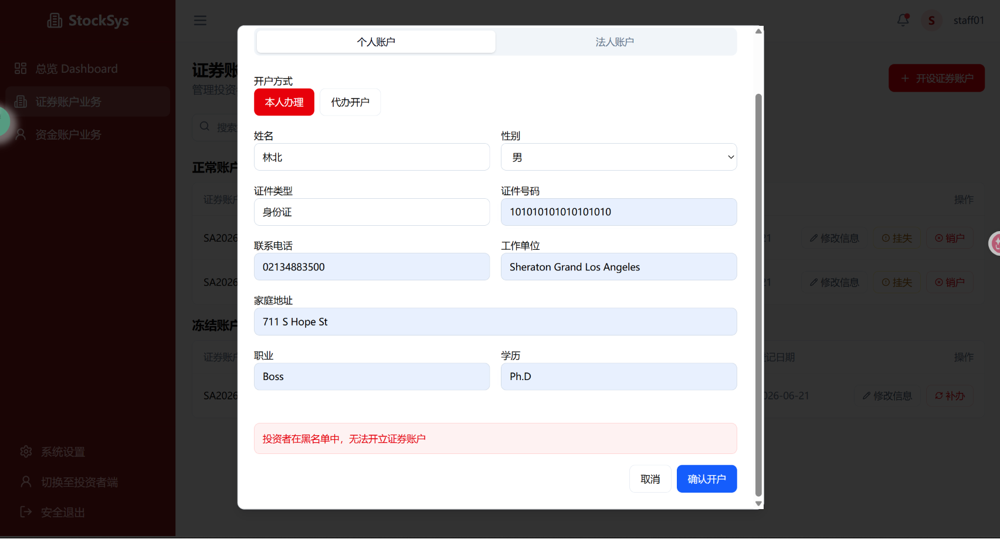

2. 使用有效资金账户登录交易客户端，尝试修改交易密码，预期修改成功，旧密码失效且新密码可正常使用。


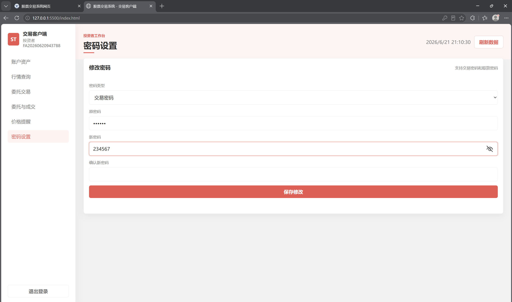
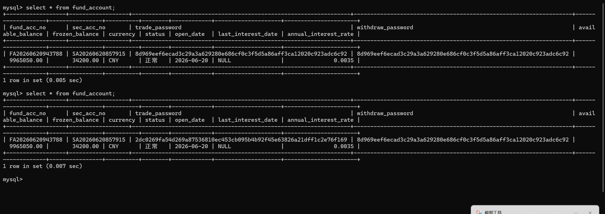

3. 由交易客户端发起买入委托并请求冻结相应资金，预期资金冻结成功，可用资金减少且冻结资金增加相同金额。

原先账户内容


交易发起但未撮合


冻结资金:34200 + 210 * 100 = 55200


4. 由交易客户端撤销尚未撮合成交的委托，预期对应的冻结资金被解冻并转回可用资金，账户资金总额保持不变。

接着冻结资金的操作，我们撤销交易：

冻结资产解冻

55200 -> 32400

5. 由交易客户端发出交易确认请求，模拟委托成交后的资金扣款，预期对应的冻结资金减少，并生成正确的资金变更流水。

两个子系统之间现实的信息同步，查询接口顺畅

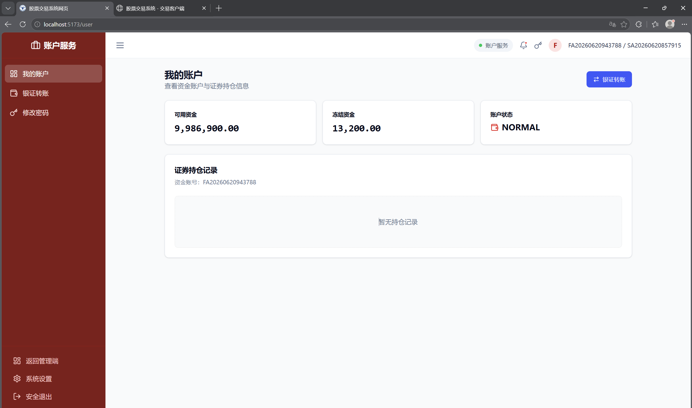

交易已撮合
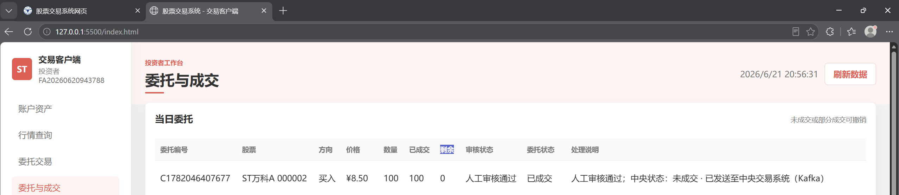

可用资金减少
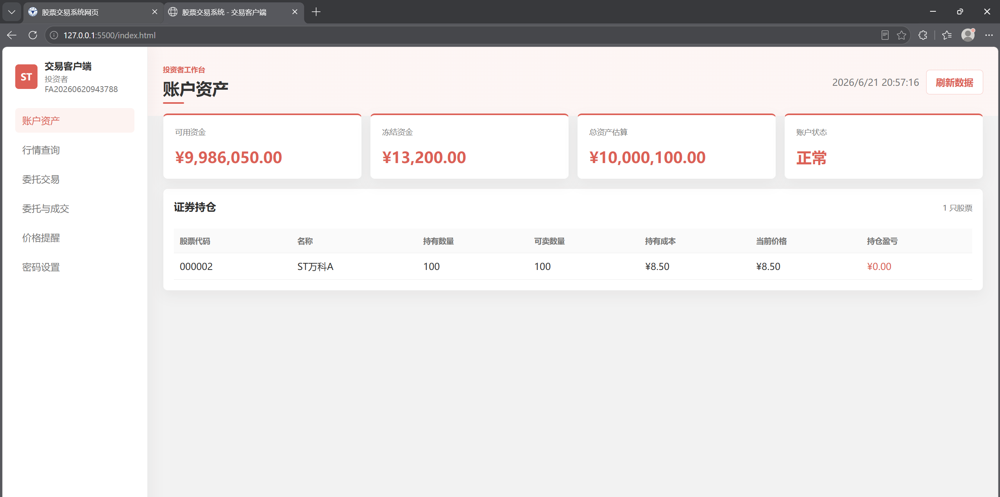

<div STYLE="page-break-after: always;"></div>

## <a name='-1'></a>6. 安全性测试

### <a name='-1'></a>6.1. 测试内容

本次安全性测试针对账户业务子系统后端服务进行，测试范围包括 `controller/`、`service/`、`dao/`、`exception/`、`config/`、`integration/` 等核心代码，以及资金账户、证券账户、工作人员登录、外部交易回调等接口。

测试方式采用静态代码审计与动态接口安全测试相结合。动态测试使用 JUnit 5、Spring MockMvc 与 H2 内存数据库执行，不依赖外部网络服务；执行命令为 `mvn test -Dtest=SecurityHardeningTest`。本轮新增安全测试 17 项，执行结果为 17 个测试全部通过；全量测试结果为 67 个测试通过、0 个失败、8 个真实 MySQL 集成测试跳过。

| 测试维度     | 测试内容                                              | 测试结果                         | 截图位置 |
| ------------ | ----------------------------------------------------- | -------------------------------- | -------- |
| 注入攻击防护 | 验证登录、查询等接口对 SQL 注入载荷的处理             | 已拦截，未破坏数据表             | 图6-1    |
| XSS 防护     | 验证脚本输入在接口响应中的返回类型与转义情况          | 响应为 JSON，不会按 HTML 执行    | 图6-2    |
| 横向越权防护 | 验证用户不能使用自己的 token 查询或修改他人账户       | 已拦截，返回鉴权错误             | 图6-3    |
| Token 安全   | 验证伪造 token、token 随机性、员工停用后的 token 失效 | 已拦截伪造 token，停用后立即失效 | 图6-4    |
| 密码安全     | 验证交易密码、取款密码在数据库中的存储形式            | 数据库存储为 64 位哈希值，非明文 | 图6-5    |
| 错误信息保护 | 验证错误取款密码时是否泄露余额等敏感字段              | 未回显余额字段                   | 图6-6    |
| 交易回调认证 | 验证外部交易回调接口是否需要认证或签名                | 当前存在无认证调用风险           | 图6-7    |
| 登录错误信息 | 验证登录失败错误码是否会暴露账户存在性                | 当前存在用户枚举风险             | 图6-8    |
| 管理接口权限 | 验证普通工作人员是否可以调用管理员接口                | 当前缺少角色权限控制             | 图6-9    |
| 敏感信息保护 | 验证列表接口是否批量返回完整身份证号等 PII            | 当前存在批量泄露风险             | 图6-10   |
| 令牌传输方式 | 验证客户端接口是否通过 URL query 传递 auth_token      | 当前存在日志泄露风险             | 图6-11   |
| 异常处理     | 验证缺少必填 Header 时的错误响应                      | 当前返回 500 并回显内部异常信息  | 图6-12   |


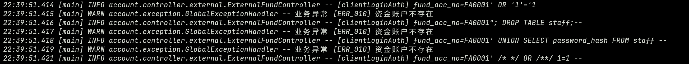
**图6-1：注入攻击防护**


**图6-2：XSS 防护**

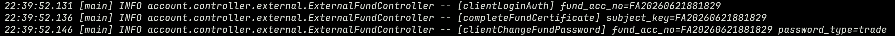
**图6-3：横向越权防护**

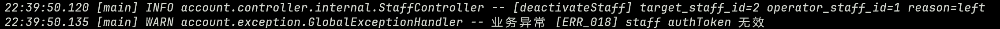
**图6-4：Token 安全**

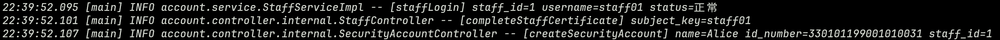
**图6-5：密码安全**


**图6-6：错误信息保护**

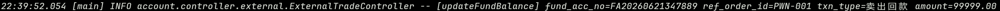
**图6-7：交易回调认证**


**图6-8：登录错误信息**


**图6-9：管理接口权限**


**图6-10：敏感信息保护**


**图6-11：令牌传输方式**


**图6-12：异常处理**

**防护型安全测试用例**

| 用例编号 | 测试场景              | 操作步骤                                                     | 预期结果                                                     | 截图位置 |
| -------- | --------------------- | ------------------------------------------------------------ | ------------------------------------------------------------ | -------- |
| SAFE-001 | 登录 SQL 注入防护     | 在登录字段输入 `' OR '1'='1`、`UNION SELECT`、`DROP TABLE` 等载荷 | 系统返回业务错误，`staff` 表未被破坏，合法账号仍可正常登录   | 图6-1    |
| SAFE-002 | 查询参数 SQL 注入防护 | 在资金账户快照查询参数中拼接 SQL 注入语句                    | 系统按普通参数处理，不返回他人账户信息                       | 图6-1    |
| SAFE-003 | XSS 输入防护          | 使用 `<script>alert(1)</script>` 作为姓名发起开户请求        | 接口响应类型为 `application/json`，浏览器不会当作 HTML 脚本执行 | 图6-2    |
| SAFE-004 | 资金账户横向越权防护  | A 用户登录后，使用 A 的 `auth_token` 查询 B 的资金账户快照   | 返回鉴权错误，不能访问 B 的账户信息                          | 图6-3    |
| SAFE-005 | 证券账户横向越权防护  | A 用户登录后，使用 A 的 `auth_token` 查询 B 的证券持仓       | 返回鉴权错误，不能访问 B 的持仓信息                          | 图6-3    |
| SAFE-006 | 修改他人资金密码防护  | A 用户使用自己的 `auth_token` 修改 B 的资金账户密码          | 返回鉴权错误，B 原密码仍可正常登录                           | 图6-3    |
| SAFE-007 | 伪造 Token 防护       | 构造一个 64 位十六进制伪 token 调用接口                      | 系统拒绝访问，返回鉴权错误                                   | 图6-4    |
| SAFE-008 | Token 随机性验证      | 同一账户连续登录两次，比较两次签发的 token                   | token 为 64 位十六进制字符串，且两次结果不同                 | 图6-4    |
| SAFE-009 | 员工停用后 Token 失效 | 工作人员登录后被管理员停用，再使用旧 token 调用内部接口      | 旧 token 立即失效，接口拒绝访问                              | 图6-4    |
| SAFE-010 | 密码加密存储          | 直接查询数据库中的 `trade_password` 与 `withdraw_password` 字段 | 字段值为哈希值，与明文密码不同                               | 图6-5    |
| SAFE-011 | 错误密码响应保护      | 输入错误取款密码发起取款请求                                 | 返回密码错误提示，响应中不包含账户余额字段                   | 图6-6    |


**漏洞固化与风险确认用例**

以下用例用于确认当前系统中仍存在的安全风险。测试通过表示该风险可以被稳定复现，后续修复后应同步调整断言作为回归测试。

| 用例编号 | 测试场景                         | 操作步骤                                                     | 当前结果                                   | 处理建议                                    |
| -------- | -------------------------------- | ------------------------------------------------------------ | ------------------------------------------ | ------------------------------------------- |
| RISK-001 | 交易回调接口无认证               | 不携带 token 或签名，直接调用 `/api/external/trade/fund-balance` 修改账户余额 | 接口返回成功，余额被实际改写               | 增加 HMAC 签名或独立 system token 校验      |
| RISK-002 | 登录错误信息可枚举账户           | 分别使用不存在的账户号和存在但密码错误的账户号登录           | 两种场景返回不同错误码，可推断账户是否存在 | 登录失败统一返回“账户号或密码错误”          |
| RISK-003 | 管理接口缺少角色权限控制         | 普通工作人员登录后调用 `/api/admin/fund/settle-annual-interest` | 调用成功，普通员工可执行管理员操作         | 增加工作人员角色字段和 RBAC 校验            |
| RISK-004 | 列表接口批量泄露敏感信息         | 使用工作人员 token 调用账户列表接口                          | 返回姓名和完整 18 位身份证号               | 身份证号脱敏，列表分页并增加权限控制        |
| RISK-005 | `auth_token` 通过 URL query 传递 | 调用快照接口时在 URL 中携带 `auth_token`                     | token 会出现在浏览器地址栏和服务器日志中   | 改为 Header 或 `Authorization: Bearer` 传递 |
| RISK-006 | 缺少 Header 时异常信息回显       | 不携带 `X-Staff-Auth-Token` 调用内部接口                     | 返回 HTTP 500，并包含 Spring 内部异常文本  | 在全局异常处理器中单独处理缺失 Header 场景  |

**静态审计发现**

| 编号  | 风险点               | 说明                                                         | 处理建议                                                 |
| ----- | -------------------- | ------------------------------------------------------------ | -------------------------------------------------------- |
| W-001 | 密码哈希算法偏弱     | 当前 `PasswordUtil` 使用 SHA-256 且无 salt，抗彩虹表能力不足 | 改为 BCrypt、PBKDF2 或 Argon2，并为每个用户生成独立 salt |
| W-002 | 数据库存在默认凭证   | 默认配置中存在 `root/root` 与 `useSSL=false`                 | 部署时强制使用环境变量配置数据库账号密码，并开启安全连接 |
| W-003 | 异常信息回显         | `GlobalExceptionHandler` 会把内部异常信息拼接到响应中        | 线上统一返回错误码和 traceId，详细异常只写入日志         |
| W-004 | CORS 配置不明确      | 代码中未发现明确的 CORS 配置，与说明文档存在不一致           | 明确跨域策略，避免全开放或配置缺失                       |
| W-005 | 登录缺少限速         | 工作人员登录和资金账户登录均未做失败次数限制                 | 增加失败计数、冷却时间或验证码                           |
| W-006 | 黑名单服务异常时放行 | 黑名单校验异常仅记录日志，开户流程继续执行                   | 黑名单服务失败时改为业务失败，避免绕过风控               |

**优先级建议**

| 优先级 | 问题                                                         | 处理建议                         |
| ------ | ------------------------------------------------------------ | -------------------------------- |
| P0     | 交易回调无认证、管理接口缺少权限控制、列表接口批量泄露身份证号 | 联调上线前必须修复               |
| P1     | 登录错误可枚举账户、`auth_token` 通过 URL 传递、密码哈希算法偏弱、数据库默认凭证 | 联调前完成修复或给出明确规避方案 |
| P2     | 异常信息回显、CORS 配置不明确、登录缺少限速、黑名单服务异常放行 | 后续迭代中完善                   |

<div STYLE="page-break-after: always;"></div>

## <a name='-1'></a>7. 对软件功能的结论

### <a name='-1'></a>7.1. 证券账户管理功能

#### <a name='-1'></a>7.1.1. 能力

证券账户管理功能已形成较完整的账户生命周期处理能力。系统支持成年自然人及法人开户，能够校验证件格式、投资者年龄、重复开户和黑名单状态；支持账户及持仓快照查询，并依据账户状态限制受限操作；支持持有人资料修改，修改时继续执行证件唯一性和年龄校验；支持挂失、补办和销户，补办时可生成新账号、关闭旧账号并迁移持仓，销户时能够校验持仓是否清零及持有人身份。

边界测试表明，系统能够正确处理持仓冻结量等于全部可卖数量、补办时仅存在冻结持仓等场景。交易联调及压力测试还验证了持仓变更回调的幂等性：同一业务请求重复提交时不会重复修改持仓或重复生成流水。在并发度 24、总任务数 120 的重复持仓回调场景中，120 次请求全部成功，平均耗时为 41.22 ms。

#### <a name='-1'></a>7.1.2. 限制

证券账户功能目前仍受以下因素限制：外部持仓变更接口缺少可靠的系统身份认证或请求签名，不能防止未经授权的调用；账户列表会返回完整身份证号等敏感信息，缺少脱敏和更细粒度的查询权限控制。

此外，证券账户列表、持仓及仪表盘等查询共享当前 DAO 连接方式。在高并发混合查询下，逐条补查和即时创建数据库连接会放大数据库访问次数，因此本功能尚不能证明满足大型的、高并发生产环境的稳定性要求。

### <a name='-1'></a>7.2. 资金账户管理功能

#### <a name='-1'></a>7.2.1. 能力

资金账户管理功能能够完成开户及证券账户绑定、账户登录、密码修改、存款、取款、快照查询、挂失、补办、销户和活期利息处理。系统能够阻止遗漏绑定和重复绑定，按账户状态限制登录及业务操作，并对原密码、两次新密码、交易金额和可用余额进行校验。补办时能够将旧账户可用余额和冻结余额合并迁移至新账户，销户前能够检查余额是否清零；日常计息结果、年度结息结果及相应资金流水均可查询。

边界测试验证了零金额存款、全额取款、补办余额迁移、年度结息零天差和一天差舍入等场景。接口联调验证了交易客户端登录、密码修改、资金冻结、撤单解冻和成交扣款等跨子系统流程，账户数据能够同步更新。资金回调具备幂等处理能力；在并发度 24、总任务数 120 的重复资金回调场景中，120 次请求全部成功，平均耗时为 36.85 ms。

#### <a name='-1'></a>7.2.2. 限制

资金账户的外部余额变更接口当前无需 token 或签名即可调用，攻击者可能伪造交易回调并修改余额，属于上线前必须处理的风险。部分客户端接口通过 URL query 传递 `auth_token`，令牌可能被浏览器历史、代理或服务器日志记录。

性能方面，混合查询场景在并发度 40、总请求数 400 时成功 385 次、失败 15 次，平均耗时 1020.33 ms，P95 为 3495 ms。主要限制是 DAO 层未使用连接池，且仪表盘和账户列表存在逐条补查，短时间大量建连会导致数据库连接及客户端临时端口资源耗尽。因此，资金账户的串行业务流程和回调幂等性已得到验证，但高并发查询能力尚未达到本轮测试的通过标准。

<div STYLE="page-break-after: always;"></div>

## <a name='-1'></a>8. 分析摘要

### <a name='-1'></a>8.1. 能力

综合模块功能、边界异常、压力、接口联调和安全性测试，账户业务子系统已具备以下能力：

- 工作人员能够登录系统、查看仪表盘和操作日志，停用账号后原有 token 可立即失效。
- 证券账户和资金账户的开户、查询、资料维护、挂失、补办、销户等主要生命周期流程可以正常执行，关键状态流转和前置业务规则有效。
- 资金账户支持登录、密码修改、存取款、余额与冻结资金管理、活期利息和年度结息；证券账户支持持仓查询、持仓冻结与迁移。
- 系统能够处理空值、非法证件、非法金额、余额不足、重复开户、重复绑定、冻结账户及临界金额等异常或边界输入。
- 交易客户端与账户业务子系统之间的密码修改、账户快照、资金冻结、撤单解冻、成交扣款和持仓变更流程可以联调，资金及持仓回调具备幂等性。
- 已验证参数化数据库访问可抵御本轮 SQL 注入载荷，JSON 响应不会直接执行 XSS 脚本；横向越权、伪造 token、停用员工继续访问及错误密码敏感数据回显等场景能够被拦截。
- 自动化安全测试共执行 17 项并全部通过；全量后端测试共 67 项通过、0 项失败，另有 8 项真实 MySQL 集成测试因环境条件跳过。压力测试的 4 个场景中，并发开户和两类重复回调场景通过，混合并发查询场景未通过。

### <a name='-1'></a>8.2. 缺陷和限制

| 优先级 | 缺陷或限制 | 影响 | 建议 |
| ------ | ---------- | ---- | ---- |
| P0 | 外部资金、持仓交易回调缺少认证或签名 | 未授权请求可能直接修改余额或持仓 | 增加 HMAC 签名、时间戳与重放保护，或使用独立的系统 token |
| P0 | 账户列表批量返回完整身份证号 | 可能造成投资者个人敏感信息批量泄露 | 默认脱敏，增加分页、最小字段返回和细粒度权限控制 |
| P1 | 混合并发查询未通过 | 40 并发下出现 15 次连接失败，查询延迟较高 | 引入数据库连接池，消除逐条补查并优化聚合查询 |
| P1 | `auth_token` 通过 URL query 传递 | 令牌可能泄露到历史记录和日志 | 改用 `Authorization: Bearer` 或受保护的请求 Header |
| P1 | 密码使用无 salt 的 SHA-256 | 抗彩虹表和离线破解能力不足 | 改用 BCrypt、PBKDF2 或 Argon2，并使用独立 salt |
| P1 | 数据库配置存在默认凭证且关闭 SSL | 部署配置泄露后可能导致数据库被直接访问或链路被窃听 | 使用环境变量或密钥管理服务，并启用安全连接 |
| P2 | 登录缺少失败限速，CORS 策略不明确 | 增加暴力破解及跨域配置不当风险 | 增加失败计数、冷却或验证码，并显式配置来源白名单 |

综上，系统主要业务流程和数据一致的功能已实现并可用，已可以在一般条件下使用。但如果要在大型生产环境中上线，仍有进一步完善空间。

### <a name='-1'></a>8.3. 测试资源

| 资源类别 | 本次使用的资源 |
| -------- | -------------- |
| 测试人员 | 叶泰桢、张钊、杨世博、林哈利、崔大元、张瑞喆 |
| 硬件与网络 | 本地 PC 开发与测试环境，数据库及应用服务部署于本机回环网络 |
| 基础软件 | MySQL 8.0、H2 内存数据库、Chrome、Edge、JDK 与 Maven |
| 测试工具 | JUnit 5、Spring MockMvc、Maven Surefire、Postman、JMeter、PowerShell、Python Pillow |
| 自动化测试代码 | `src/test/java/account/` 下的业务规则、工作流、DAO、接口集成、安全加固、真实 MySQL 集成及压力测试套件 |
| 压力测试资产 | `PressTest/run-pressure-tests.ps1`、`PressureTestSuite.java`、`scenario-config.json`、`samples/*.json` |
| 测试数据与数据库脚本 | `scripts/` 下的建表、视图、测试数据和存储过程脚本，以及测试专用数据库 `account_db_pressure` |
| 结果与证据 | `PressTest/results/` 中的 JSON、CSV 结果，`pictures/` 中的功能、边界、联调、安全及压力测试截图 |

测试资源能够支持本轮功能、边界、接口、安全和压力测试的复现。